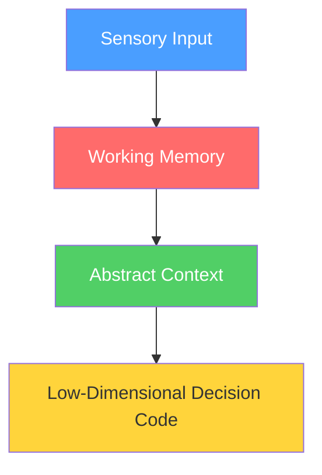
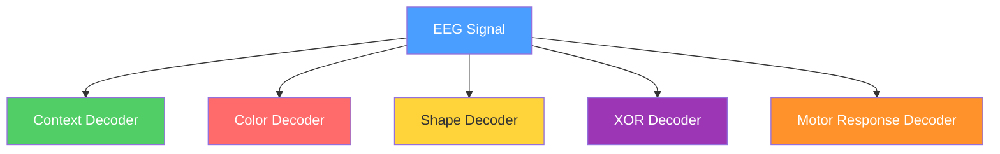
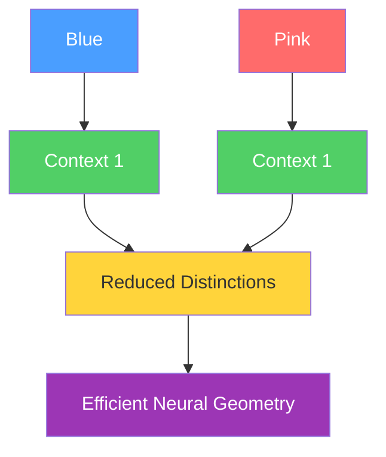

# Working Memory Shapes Neural Geometry in Human EEG Over Learning

<div class="pt-4 text-lg opacity-80">
Wojcik et al., 2025
</div>

<div class="pt-2 text-sm opacity-60">
Does working memory simply store sensory information, or does it actively transform information into a more efficient representation for future decisions?
</div>

<div class="abs-br m-6 flex gap-2">
  <a href="#" target="_blank" class="text-xl slidev-icon-btn opacity-50 !border-none !hover:text-white">
    📄
  </a>
</div>

---
transition: fade-out
---

# Why This Paper Matters

<div class="grid grid-cols-2 gap-8">

<div>

### Traditional View

Working Memory = Temporary Storage

### Modern View

Working Memory = Active Computation

Information is transformed while maintained.

</div>

<div>

### Theoretical Inspiration

- Memory as computational resource
- Neural geometry
- Dynamic coding
- Temporal decomposition of computation

**The paper tests these ideas in humans using EEG.**

</div>

</div>

---
transition: fade-out
---

# Main Hypothesis

<div class="flex justify-center">



</div>

<div class="mt-4 p-4 bg-blue-500/10 rounded-lg text-center">

**Instead of remembering exact sensory details, working memory should retain only information useful for future decisions.**

</div>

---
transition: fade-out
---

# Task Design

<div class="grid grid-cols-2 gap-8">

<div>

### Trial Structure

Participants learn an XOR rule.

```
Color Cue → Delay → Shape → Response
```

The correct response depends on:

$$\text{Response} = \text{XOR}(\text{Color}, \text{Shape})$$

Participants must learn by trial and error.

</div>

<div>

### Why XOR?

The task can be solved using two strategies:

**Strategy 1: Memorization**
- Blue + Square = Left
- Blue + Diamond = Right
- High-dimensional

**Strategy 2: Context Representation**
- Convert colors into contexts
- Store context
- Compute XOR from context + shape
- Low-dimensional

**This is what the authors predict humans will do.**

</div>

</div>

---
transition: fade-out
---

# Context vs Color

<div class="grid grid-cols-2 gap-8">

<div>

### First Stimulus Contains:

**Irrelevant Information:**
- Blue
- Green
- Pink
- Khaki

**Relevant Information:**
- Context 1
- Context 2

</div>

<div>

### The Critical Question:

<div class="mt-8 p-6 bg-yellow-500/10 rounded-lg text-center text-xl font-bold">

**Does working memory store color or context?**

</div>

</div>

</div>

---
transition: fade-out
---

# Behavioral Evidence for Context Coding

<div class="grid grid-cols-2 gap-8">

<div>

### Learning Progress

- **Stage 1**: 75% accuracy
- **Stage 4**: 96% accuracy

### Context Switches

Context switches produced:
- Lower accuracy
- Slower responses

than shape switches.

</div>

<div>

### Interpretation

<div class="mt-8 p-6 bg-green-500/10 rounded-lg">

**Participants treated context as the important variable.**

The brain learns to extract abstract context from raw sensory input.

</div>

</div>

</div>

---
transition: fade-out
---

# EEG Decoding Framework

<div class="flex justify-center">



</div>

<div class="mt-4 p-4 bg-blue-500/10 rounded-lg text-center">

**Question**: What information is represented at each point in time?

</div>

---
layout: two-cols-header
transition: fade-out
---

# Result 1: Context Is Maintained

::left::

### Context Decoding

```
Color Onset → Delay → Shape Onset
```

remains above chance throughout the delay.

Learning strengthens delay-period context coding.

::right::

<div class="ml-6 mt-4">


<div class="mt-4 p-3 bg-green-500/10 rounded-lg text-sm">

**Interpretation**: Working memory actively maintains context.

</div>

</div>

---
layout: two-cols-header
transition: fade-out
---

# Result 2: Color Is Discarded

::left::

### Color Decoding

- Strong immediately after cue
- Rapidly falls to chance before the delay

::right::

<div class="ml-6 mt-4">


<div class="mt-4 p-3 bg-red-500/10 rounded-lg text-sm">

**Interpretation**: Working memory filters out irrelevant sensory information.

The brain keeps: **Context**
The brain removes: **Color identity**

</div>

</div>

---
layout: two-cols-header
transition: fade-out
---

# Result 3: XOR Representation Emerges

::left::

### XOR Decoding

After shape presentation:
- XOR decoding increases significantly with learning

### Meaning

The brain constructs the task rule:

```
Context + Shape = XOR
```

The XOR signal is not present in the stimulus.
It must be computed.

::right::

<div class="ml-6 mt-4">


<div class="mt-4 p-3 bg-purple-500/10 rounded-lg text-sm">

**Interpretation**: The brain computes the task rule from context and shape.

</div>

</div>

---
layout: two-cols-header
transition: fade-out
---

# Result 4: Context Becomes Abstract

::left::

### Cross-Generalization Analysis

**Train**: Blue vs Green
**Test**: Pink vs Khaki

If decoding succeeds:
- Context representation is independent of color

**Result**: Cross-generalized context decoding increases with learning.

::right::

<div class="ml-6 mt-4">


<div class="mt-4 p-3 bg-green-500/10 rounded-lg text-sm">

**Interpretation**: Context becomes an abstract variable.

</div>

</div>

---
transition: fade-out
---

# What Is Neural Geometry?

<div class="grid grid-cols-2 gap-8">

<div>

### High-Dimensional Geometry

Think of every task condition as a point in neural space:

- Blue Square
- Blue Diamond
- Green Square
- ...

All represented separately.

</div>

<div>

### Low-Dimensional Geometry

Only task-relevant distinctions remain:

- Context 1
- Context 2
- XOR True
- XOR False

**This is more efficient.**

</div>

</div>

<div class="mt-4 p-4 bg-yellow-500/10 rounded-lg text-center">

**Question**: Does learning change the geometry of neural representations?

</div>

---
transition: fade-out
---

# Result 5: Decision Representations Become XOR-Dominated

<div class="grid grid-cols-2 gap-8">

<div>

### Immediately Before Response

The authors examine neural geometry.

**Results:**
- XOR decoding increases: 0.516 → 0.572
- Abstract XOR coding increases: 0.512 → 0.560

### Interpretation

The representation becomes organized around the final decision variable.

**Not around sensory details.**

</div>

<div>


<div class="mt-4 p-3 bg-blue-500/10 rounded-lg text-sm">

**Key Finding**: Learning transforms the geometry to emphasize task-relevant distinctions.

</div>

</div>

</div>

---
transition: fade-out
---

# Surprising Finding: Dimensionality Does Not Decrease

<div class="grid grid-cols-2 gap-8">

<div>

### Expectation

Learning → Lower dimensionality

### Actual Result

Low dimensionality already exists early.
No significant change for correct trials.

### Why?

Working memory compression occurs immediately.

The delay forces participants to:
```
Color → Context
```
from the start.

</div>

<div>


<div class="mt-4 p-3 bg-orange-500/10 rounded-lg text-sm">

**Interpretation**: The compression happens immediately, not gradually.

</div>

</div>

</div>

---
layout: two-cols-header
transition: fade-out
---

# Critical Result

::left::

### The Strongest Analysis

**Question**: Does stronger context maintenance predict lower-dimensional decision representations?

**Answer**: Yes.

```
Better context maintenance → Lower dimensionality
```

**Correlation**: r = -0.37, p = 0.04

::right::

<div class="ml-6 mt-4">


<div class="mt-4 p-3 bg-green-500/10 rounded-lg text-sm">

**Key Insight**: Working memory compression directly influences the geometry of decision representations.

</div>

</div>

---
transition: fade-out
---

# Computational Interpretation

<div class="flex justify-center">



</div>

<div class="mt-4 p-4 bg-blue-500/10 rounded-lg text-center">

**Working memory performs Selection and Compression.**

The process reduces unnecessary distinctions, creating a more efficient neural geometry.

</div>

---
transition: fade-out
---

# Relation to the NeurIPS 2024 RNN Paper

<div class="grid grid-cols-2 gap-8">

<div>

### NeurIPS 2024

- RNN model
- Working memory transforms geometry
- Low-dimensional representations emerge

### Current EEG Paper

- Human EEG
- Same geometric transformation observed in biological brains

</div>

<div>

### Common Message

<div class="mt-4 p-6 bg-green-500/10 rounded-lg text-center text-xl font-bold">

**Working Memory ≠ Storage**

**Working Memory = Geometry Transformation**

</div>

<div class="mt-4 text-sm opacity-70">

Both computational models and human brains show that working memory actively transforms representations to create more efficient geometries for decision-making.

</div>

</div>

</div>

---
transition: fade-out
---

# Main Conclusions

<div class="grid grid-cols-2 gap-8">

<div>

<v-clicks>

1. **Working memory stores context, not sensory details.**

2. **Irrelevant color information is discarded.**

3. **Context becomes increasingly abstract.**

4. **XOR representations emerge through learning.**

</v-clicks>

</div>

<div>

<v-clicks>

5. **Strong context maintenance predicts simpler neural geometry.**

6. **Working memory acts as a computational resource that compresses information for future decisions.**

</v-clicks>

</div>

</div>

<div class="mt-6 p-4 bg-purple-500/10 rounded-lg text-center text-lg font-bold">

**Working Memory = Geometry Transformation**

</div>

---
layout: center
class: text-center
transition: fade
---

# Thank You

<div class="pt-8 text-lg opacity-80">

**Paper**: Wojcik et al., 2025

**Topic**: Working Memory Shapes Neural Geometry in Human EEG Over Learning

</div>

<div class="pt-8">
  <span class="opacity-50 text-sm">
    Built with Slidev + Academic Theme
  </span>
</div>
