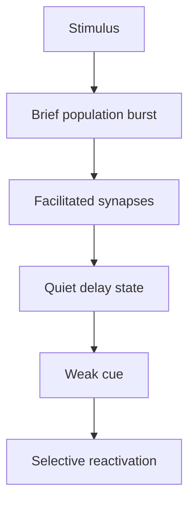
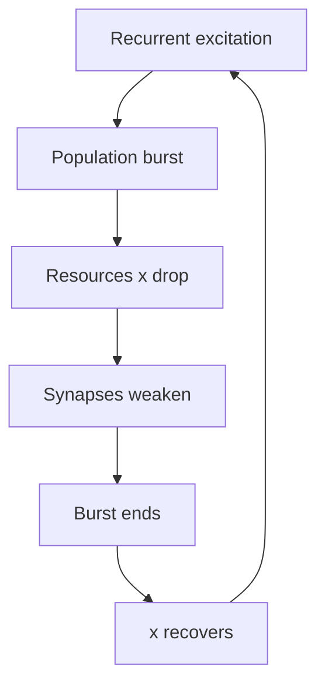
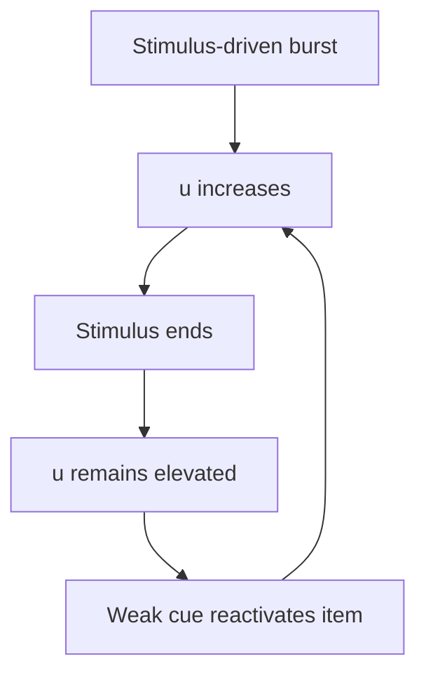
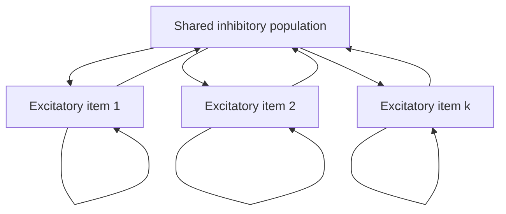
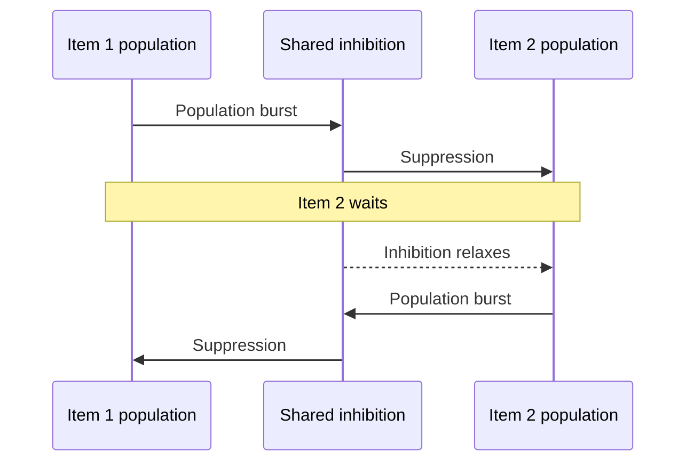
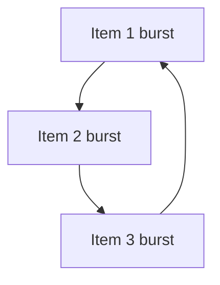
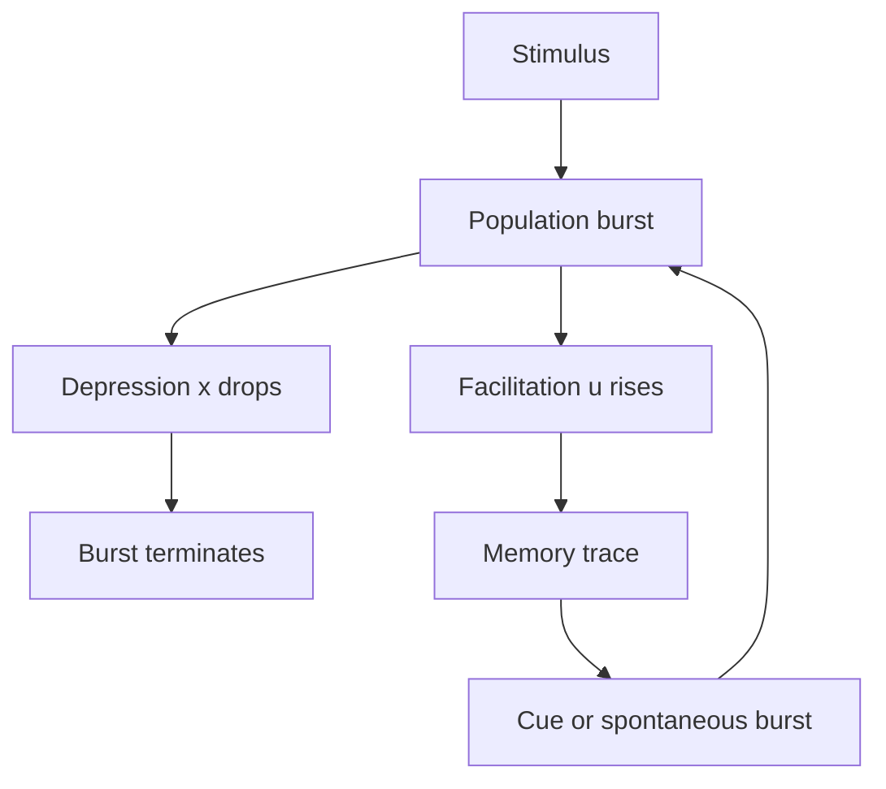

# Exact Neural Mass Model for Synaptic-Based Working Memory

Halgurd Taher, Alessandro Torcini, Simona Olmi

PLOS Computational Biology, published December 15, 2020

A mathematically exact and computationally efficient population model for working memory stored in short-term synaptic plasticity.

---
layout: section
transition: fade
class: section-divider
---

# 1 - Background

---
transition: fade-out
class: compact
---

# Classical View: Persistent Spiking

### The Standard Theory

- A memory is maintained by continuous neuronal firing during the delay
- Similar to keeping a switch permanently on
- Supported by early prefrontal cortex recordings in monkeys
- Used in models of spatial WM, multi-item storage, and delayed discrimination

### Mechanistic Picture

- Stimulus activates an item-specific neural population
- That population remains elevated throughout the delay
- The readout depends on sustained firing at response time
- Memory failure occurs if activity decays or is disrupted

In this view, the memory trace is carried by ongoing neural activity rather than by a hidden synaptic state.

---
transition: fade-out
class: compact
---

# Why Persistent Spiking Is Not Enough

### Empirical Concerns

- Trial-averaged activity can make sparse firing look persistent
- Only a small fraction of neurons show true persistent firing
- Individual neurons often behave heterogeneously and irregularly

### Computational Concerns

- Continuous firing is metabolically expensive
- Persistent states can interfere with each other
- New sensory inputs can disrupt stored items
- Pure firing-rate models miss fast collective oscillations

The problem is not whether persistent activity exists. The problem is whether it is the only or dominant mechanism for working memory.

---
transition: fade-out
class: compact
---

# Synaptic Theory of Working Memory

### Key Idea

Memory is stored in synapses, not necessarily in continuous firing.

- Proposed by Mongillo, Barak, and Tsodyks (2008)
- Uses short-term synaptic plasticity
- Spikes modify synaptic efficacy
- Brief bursts can refresh the trace

This is more energy efficient and can support multiple items with less interference.

---
transition: fade-out
class: compact
---

# The Gap This Paper Fills

### Previous Synaptic WM Models

- Often used heuristic firing-rate equations
- Not derived exactly from spiking neuron dynamics
- Tracked firing rate but not mean membrane potential
- Could miss fast beta-gamma oscillations and other macroscopic dynamics

### Needed Model

- Population-level model
- Mathematically derived from spiking neurons
- Includes facilitation and depression
- Captures firing rate and mean membrane voltage
- Comparable to EEG, LFP, and ERP signals

---
layout: section
transition: fade
class: section-divider
---

# 2 - Main Innovation

---
transition: fade-out
class: compact
---

# What Is New?

### The Paper Introduces

1. An exact neural mass model
2. Short-term facilitation and depression
3. Heterogeneous neuron populations
4. Firing rate and mean membrane voltage variables
5. Multi-population WM architecture

### Why It Matters

- The model is not a fitted approximation
- It is derived from quadratic integrate-and-fire neurons
- It reduces huge spiking networks to a few macroscopic equations
- It can reproduce experimental frequency-band signatures

Microscopic spiking dynamics become a tractable, exact population theory.

---
transition: fade-out
class: compact
---

<h1 class="!text-4xl !leading-tight !mb-4">Compression Without Losing the Dynamics</h1>

### From Network to Neural Mass

- Starts from a large QIF spiking network
- Uses Lorentzian heterogeneity and Ott-Antonsen reduction
- Replaces hundreds of thousands of neuron equations with a few population variables
- Keeps the collective dynamics needed for working memory

Main point: the reduction is exact under the model assumptions, not a fitted approximation.

### Four Variables Per Excitatory Population

  

    <b><i>r</i>k</b> 
    Firing rate 
    population spiking output
  

  

    <b><i>v</i>k</b> 
    Mean voltage 
    EEG/LFP-like signal
  

  

    <b><i>x</i>k</b> 
    Synaptic resources 
    depression variable
  

  

    <b><i>u</i>k</b> 
    Utilization factor 
    facilitation trace
  

Subscript <i>k</i> indexes the excitatory population, meaning the item-specific neural group.

---
transition: fade-out
class: compact
---

# Why Mean Membrane Potential Matters

### Firing Rate Alone

- Captures how much the population spikes
- Useful for network output
- Insufficient for direct comparison with field-potential measurements

### Mean Voltage Adds a Bridge

- EEG, LFP, and ERP signals correlate more directly with population voltage
- Enables memory-load measures analogous to ERP experiments
- Reveals oscillatory dynamics invisible in simple rate models

---
layout: section
transition: fade
class: section-divider
---

# 3 - Building Blocks

---
transition: fade-out
class: compact
---

# Quadratic Integrate-and-Fire Neurons

The microscopic network is built from QIF neurons:

$$
\tau_m \dot{V}_i =
V_i^2 + \eta_i + I_B + I_S(t)
+ \tau_m \frac{1}{N}\sum_{j=1}^{N}\tilde{J}_{ij}(t)S_j(t)
$$

| Term | Meaning |
|---|---|
| $\tau_m = 15$ ms | Membrane response time |
| $V_i^2$ | QIF spike-generating dynamics |
| $\eta_i$ | Individual excitability |
| $I_B$ | Background current |

| Term | Meaning |
|---|---|
| $I_S(t)$ | External stimulus |
| $\tilde{J}_{ij}(t)$ | Synaptic coupling |
| $S_j(t)$ | Spike train from neuron $j$ |
| $\sum J S$ | Recurrent network input |

---
transition: fade-out
class: compact
---

# Heterogeneity Makes the Reduction Exact

Each neuron has a different excitability:

$$
g(\eta) =
\frac{1}{\pi}
\frac{\Delta}{(\eta-H)^2+\Delta^2}
$$

### Biological Role

- Neurons are not identical
- Excitability varies across the population
- $H$ is the median excitability
- $\Delta$ controls population diversity

### Mathematical Role

- Lorentzian heterogeneity enables the Ott-Antonsen reduction
- The thermodynamic limit $N \to \infty$ becomes analytically tractable
- The result is a closed neural mass model

---
transition: fade-out
class: compact
---

# Short-Term Synaptic Plasticity

### Depression: <i>x</i>k(t)

- Available synaptic resources
- Spikes deplete neurotransmitter resources
- Recovers quickly: $\tau_d = 200$ ms
- Creates and terminates population bursts

$$
\dot{x}_k = \frac{1-x_k}{\tau_d} - u_kx_kr_k
$$

### Facilitation: <i>u</i>k(t)

- Utilization or release probability
- Spikes increase release probability
- Decays slowly: $\tau_f = 1500$ ms
- Stores the memory trace

$$
\dot{u}_k = \frac{U_0-u_k}{\tau_f} + U_0(1-u_k)r_k
$$

Baseline utilization is <i>U</i>0 = 0.2. The key timescale relation is <i>&tau;</i>f &gg; <i>&tau;</i>d: depression recovers fast, while facilitation persists as the temporary memory trace.

---
transition: fade-out
class: compact
---

# Why Facilitation and Depression Complement Each Other

### Depression Creates Bursts

### Facilitation Stores Memory

---
layout: section
transition: fade
class: section-divider
---

# 4 - Neural Mass Model

---
transition: fade-out
class: compact
---

# The Four-Equation Model

For excitatory population $k$:

$$
\tau_m^n \dot{r}_k =
\frac{\Delta_k}{\tau_m^n \pi} + 2r_k v_k
$$

$$
\tau_m^n \dot{v}_k =
v_k^2 + H_k + I_B + I_S^{(k)}(t)
- (\pi\tau_m^n r_k)^2
+ \tau_m^n \sum_l \tilde{J}_{kl}(t)r_l
$$

$$
\dot{x}_k =
\frac{1-x_k}{\tau_d} - u_kx_kr_k
\qquad
\dot{u}_k =
\frac{U_0-u_k}{\tau_f} + U_0(1-u_k)r_k
$$

---
transition: fade-out
class: compact
---

# Reading the Equations

### Fast Neural Variables

- $r_k$: population firing rate
- $v_k$: mean membrane potential
- $\Delta_k$ injects heterogeneity into rate dynamics
- $-(\pi\tau_m r_k)^2$ balances high firing activity
- Coupling terms carry inputs from other populations

### Slow Synaptic Variables

- $x_k$: available resources, recovers quickly
- $u_k$: facilitation, decays slowly
- Bursts push $x$ down and $u$ up
- Memory is carried by elevated $u$
- Refresh bursts keep $u$ from decaying

---
transition: fade-out
class: compact
---

# Multi-Population Architecture

### Network Layout

- $N_{pop}$ excitatory populations
- Each excitatory population codes one memory item
- One shared inhibitory population
- Inhibition connects densely to all excitatory populations

---
transition: fade-out
class: compact
---

# Plastic and Fixed Connections

### Fixed Inhibitory Couplings

$$
\tilde{J}_{00}=J_{ii},\quad
\tilde{J}_{0k}=J_{ie},\quad
\tilde{J}_{k0}=J_{ei}
$$

- Inhibitory-inhibitory
- Inhibitory-to-excitatory
- Excitatory-to-inhibitory

### Plastic Excitatory Couplings

$$
\tilde{J}_{kk}(t)=J_{ee}^{(s)}x_k(t)u_k(t)
$$

$$
\tilde{J}_{kj}(t)=J_{ee}^{(c)}x_j(t)u_j(t)
$$

- Self-coupling is stronger: $J_{ee}^{(s)} > J_{ee}^{(c)}$
- Memory lives in excitatory-excitatory STP

---
transition: fade-out
---

# Role of the Inhibitory Population

### Stabilization

- Prevents abnormal global synchronization
- Regulates total activity
- Stops recurrent excitation from running away

### Computation

- Enables competition between stored items
- Supports anti-phase juggling
- Generates beta-gamma rhythms through a PING-like mechanism

The paper treats inhibition as a shared control population, not as item-specific subpopulations.

---
layout: section
transition: fade
class: section-divider
---

# 5 - Verification

---
transition: fade-out
---

# How the Model Is Verified

The neural mass model is compared against two network simulations:

### Microscopic STP

- Tracks $X_i$ and $U_i$ for each neuron
- Most realistic
- Most expensive
- Roughly $3N$ differential equations

### Mesoscopic STP

- Tracks population averages $x(t)$ and $u(t)$
- Faster than microscopic STP
- Roughly $N + 2$ equations
- Directly aligned with the neural mass variables

---
transition: fade-out
---

# Figure 1 Validation Logic

### Setup

- Single excitatory population
- $N = 200{,}000$ QIF neurons
- Two rectangular stimulus pulses
- Pulse height $I_S = 2$
- Pulse duration $0.15$ s
- Inter-pulse gap $0.15$ s

### Result

- Each pulse evokes 4 decreasing population bursts
- Firing rate almost perfectly matches network simulations
- $x(t)$ and $u(t)$ match mesoscopic STP extremely well
- Small microscopic discrepancies reflect correlations and fluctuations

Conclusion: the reduced model captures the macroscopic dynamics needed to study WM mechanisms.

---
transition: fade-out
---

# Key Figure: Model Validation

  
  

    <b>Figure placeholder</b> 
    Save screenshot as: 
    <code>public/paper_figures/fig1_validation.png</code>  
    Recommended crop: Fig. 1 panels comparing neural mass, microscopic STP, and mesoscopic STP.
  

### What to Point Out

- The solid neural-mass curves should overlap the large-network simulations
- Population bursts show the model captures fast macroscopic transients
- $x(t)$ and $u(t)$ explain why bursts terminate and why the trace persists
- This figure justifies using the reduced equations for the rest of the paper

---
layout: section
transition: fade
class: section-divider
---

# 6 - Working Memory Modes

---
transition: fade-out
---

# Three Modes Controlled by Background Current

<b>Selective</b> 
Memory is silent after loading and retrieved by a weak cue.

<b>Spontaneous</b> 
Population bursts self-reactivate and refresh facilitation.

<b>Persistent</b> 
Memory is maintained by continuous elevated activity.

---
transition: fade-out
---

# Mode 1: Selective Reactivation

### Conditions

- $I_B = 1.2$
- Below threshold for spontaneous bursting
- Only stable state: low firing asynchronous activity
- Population 1 receives loading stimulus

### Dynamics

- Loading evokes beta-band population bursts around 21.6 Hz
- $u_1$ increases and remains elevated for 1-2 seconds
- $x_1$ recovers quickly after depression
- Activity returns low, but the synaptic trace remains

A later weak non-specific cue activates only the facilitated population. Retrieval is selective because of synaptic state.

---
transition: fade-out
---

# Mode 2: Spontaneous Reactivation

### Conditions

- $I_B = 1.532$
- Bistable regime
- Low firing state coexists with periodic population bursts
- Loading pushes the stimulated population onto the burst cycle

### Dynamics

- Self-sustained bursts continue after stimulus offset
- Burst frequency around 24.1 Hz
- Depression controls inter-burst timing
- Each burst refreshes facilitation
- Memory can be maintained indefinitely until parameters are changed

This is synaptic memory with automatic refresh, not continuous persistent firing.

---
transition: fade-out
---

# Mode 3: Persistent Activity

### Conditions

- $I_B = 2.0$
- Above the second Hopf bifurcation
- Low firing and persistent states coexist
- Loading drives population 1 into persistent firing

### Dynamics

- Population bursts during loading near 27.2 Hz
- After loading, $r_1 \approx 8.6$ Hz persists
- $u_1$ remains near maximal facilitation
- $x_1$ remains depressed but stable
- More metabolically expensive than silent synaptic storage

Turning down $I_B$ stops persistent activity, but memory clears only after facilitation decays.

---
transition: fade-out
---

# Key Figure: Three Working-Memory Modes

  
  

    <b>Figure placeholder</b> 
    Save screenshot as: 
    <code>public/paper_figures/fig3_wm_modes.png</code>  
    Recommended crop: Fig. 3, showing selective reactivation, spontaneous reactivation, and persistent activity.
  

### Why This Figure Is Useful

- It shows that changing only $I_B$ moves the system between WM regimes
- Selective reactivation is mostly silent during the delay
- Spontaneous reactivation uses burst-based refresh
- Persistent activity keeps the memory in elevated firing
- The same model therefore unifies competing WM mechanisms

---
transition: fade-out
---

# Why the Exact Model Beats the Heuristic Model

### Heuristic Rate Model Can

- Reproduce broad WM operations
- Show spontaneous reactivation
- Show persistent activity
- Provide a rough synaptic storage mechanism

### But It Misses

- Fast beta-gamma oscillations after stimulus onset
- Transient population bursts during loading
- Mean membrane voltage dynamics
- Direct comparison with EEG/LFP/ERP-like quantities

The missing beta-gamma activity is not a small numerical mismatch. It is a qualitative dynamical limitation.

---
transition: fade-out
---

# Key Figure: Heuristic Model Limitation

  
  

    <b>Figure placeholder</b> 
    Save screenshot as: 
    <code>public/paper_figures/fig4_heuristic_comparison.png</code>  
    Recommended crop: Fig. 4 spectrogram or time-series panels showing weak or absent beta-gamma transients.
  

### Explanation for Presentation

- The heuristic model can preserve a memory trace, but its transient dynamics are too simple
- After stimulation, it relaxes toward stable-node behavior rather than burst-rich focus dynamics
- The missing beta-gamma power matters because beta-gamma activity is observed experimentally during WM loading
- This figure supports the paper's claim that exact neural mass dynamics add biological content

---
layout: section
transition: fade
class: section-divider
---

# 7 - Competition and Juggling

---
transition: fade-out
---

# Two-Item Competition

When a second item is presented after the first, three outcomes are possible.

<b>Item 1 wins</b>  
Second stimulus is too weak or too brief. Population 2 never becomes sufficiently facilitated.

<b>Juggling</b>  
Intermediate stimulus. Both items remain facilitated and burst in anti-phase.

<b>Item 2 wins</b>  
Second stimulus is strong or long enough. Population 2 facilitation surpasses population 1.

---
transition: fade-out
---

# Juggling Mechanism

The shared inhibitory population organizes item-specific bursts into alternating time slots.

---
transition: fade-out
---

# Key Figure: Competition and Juggling

  
  

    <b>Figure placeholder</b> 
    Save screenshot as: 
    <code>public/paper_figures/fig5_6_competition_juggling.png</code>  
    Recommended crop: Fig. 5 anti-phase juggling, or Fig. 6 phase diagram of two-item outcomes.
  

### Explanation for Presentation

- Use this visual to show that memory is a competitive dynamical process
- Anti-phase bursts are the signature of successful two-item maintenance
- Shared inhibition prevents simultaneous bursting and creates alternating time slots
- The parameter map shows why small changes in stimulus strength or duration can change the final memory state

---
transition: fade-out
---

# Competition in Persistent States

### Synaptic Burst Regime

- Three possible outcomes
- Includes juggling
- Item switching can occur with relatively modest second stimulus
- Anti-phase bursting maintains multiple traces

### Persistent Activity Regime

- No juggling observed
- Only item 1 wins or item 2 wins
- Larger perturbation needed to switch
- Switching can occur by depleting resources of the dominant population

---
layout: section
transition: fade
class: section-divider
---

# 8 - Multi-Item Memory

---
transition: fade-out
---

# Loading Several Items

### Architecture

- 7 excitatory populations
- 1 shared inhibitory population
- Each excitatory population codes one item
- Sequential loading pulses
- Interval: 1.25 s
- Presentation rate: 0.8 Hz

### During Loading

- Stimulated population emits beta-gamma bursts around 27 Hz
- Other populations are transiently suppressed
- Stimulus-locked delta transients appear near 2 Hz
- Loaded items eventually organize into a splay state

---
transition: fade-out
---

# Splay State Organization

### What It Means

- All loaded populations fire with the same period
- Their phases are evenly spaced
- Each item gets a separate temporal slot
- Multiple items can coexist without simultaneous bursting

### For 3 Items

- Cycle period $T_c \approx 0.2035$ s
- Fundamental frequency $f_c \approx 5$ Hz
- Inter-burst frequency around 15 Hz
- Strong harmonic near 30 Hz

---
transition: fade-out
---

# Memory Capacity

### Simulation Result

- Maximum stable capacity: up to 5 items
- Loading 6 items: briefly maintained, then one item drops out
- Loading 7 items: instability, about 4 items remain
- Oldest and newest items can be retained

### Cognitive Interpretation

- Capacity emerges from dynamics
- No hard-coded item limit
- Naturally aligns with 3-5 item human WM capacity
- Primacy and recency effects appear at high load

---
transition: fade-out
---

# Key Figure: Multi-Item Loading and Capacity

  
  

    <b>Figure placeholder</b> 
    Save screenshot as: 
    <code>public/paper_figures/fig8_9_multi_item_capacity.png</code>  
    Recommended crop: Fig. 8 splay-state loading or Fig. 9 capacity failure for 6-7 loaded items.
  

### Explanation for Presentation

- Fig. 8 is best for showing how several item populations take turns bursting
- Fig. 9 is best for showing the capacity limit and item dropout
- The key message is that capacity emerges from timing and synaptic recovery, not from an imposed memory-slot count
- The primacy/recency pattern is useful to connect the model back to psychology

---
transition: fade-out
---

# Presentation Rate Matters

<b>Slow rates</b>  
$f_{pres} \le 9$ Hz 
Mostly recency effects: last items dominate.

<b>Optimal range</b>  
4.5-24.1 Hz 
Capacity of 5 items can be reached.

<b>Fast rates</b>  
$f_{pres} > 25$ Hz 
Destructive interference reduces capacity.

Efficient encoding occurs when stimulus timing matches the natural burst dynamics of the network.

---
transition: fade-out
---

# Analytical Capacity Formula

$$
N_c^{max} \simeq
\frac{\tau_d}{\tau_m^e}
\ln\left[
\frac{\tau_f/\tau_d}{1-U_0}
\right]
\frac{\sqrt{C}}{\pi}
$$

$$
C =
\left[
H^{(e)} + I_B
+ \tau_m^e(-|J_{ei}| + \bar{J})
\frac{\sqrt{H^{(e)}+I_B}}{\pi}
\right]
$$

### Increases Capacity

- Longer depression timescale $\tau_d$
- Higher excitability $H^{(e)}$
- Higher background current $I_B$
- Stronger excitatory coupling

### Decreases Capacity

- Stronger inhibitory-to-excitatory coupling
- Mismatch between stimulus timing and burst rhythms
- Excessive presentation frequency

---
transition: fade-out
---

# Capacity Prediction

### Formula

- Predicts $N_c^{max} \in [3.6, 4.8]$
- Dominant dependence is on $\tau_d$
- Dependence on $\tau_f/\tau_d$ is logarithmic
- Much tighter than previous heuristic estimates

### Simulation

- Measured maximum: $N_c^{max} = 5$
- Excellent agreement with the theoretical estimate
- Supports the idea that capacity is set by STP and network timing

---
layout: section
transition: fade
class: section-divider
---

# 9 - Frequency-Band Results

---
transition: fade-out
---

# Spectral Signatures of WM

### During Loading

- Transient broadband response in low frequencies
- Beta-gamma population bursts around 21-27 Hz
- Delta-band stimulus-locked transients around 2-3 Hz

### During Maintenance

- Burst cycles organize multi-item memory
- PING-like interaction generates beta-gamma activity
- Splay states create harmonic structure
- Voltage signals resemble LFP/ERP-relevant observables

---
transition: fade-out
---

# Power vs Number of Loaded Items

| Band | Model Behavior | Interpretation |
|---|---|---|
| Gamma, 25-100 Hz | Increases monotonically with load | PING-generated rhythm involving excitatory and inhibitory populations |
| Beta, 11-25 Hz | Non-monotonic, often saturating after 2-3 items | Sustained by inhibitory activity and burst timing |
| Theta, 3-11 Hz | Mostly excitatory-specific changes | Linked to single-population dynamics |
| Alpha, 8-11 Hz | No clear load variation | Consistent with human retention findings |

The model reproduces several experimentally reported load-dependent frequency-band patterns.

---
transition: fade-out
---

# Key Figure: Frequency Bands vs Memory Load

  
  

    <b>Figure placeholder</b> 
    Save screenshot as: 
    <code>public/paper_figures/fig11_frequency_bands.png</code>  
    Recommended crop: Fig. 11 power in theta, beta, gamma, and alpha bands vs number of loaded items.
  

### Explanation for Presentation

- Gamma power is the cleanest load-dependent signal
- Beta power is not simply monotonic, which makes the result more realistic
- Theta is more tied to individual excitatory population dynamics
- The lack of alpha modulation helps align the model with human retention experiments

---
transition: fade-out
---

# Comparison With Experiments

### Model Matches

- Gamma power increases with memory load
- Beta power is non-monotonic
- Alpha variation is absent or weak
- Beta-gamma rhythms appear during WM loading
- Delta transients appear during stimulus presentation

### Experimental Links

- Monkey PFC working-memory recordings
- Human somatosensory EEG responses
- Primate LFP delta transients
- Human ERP memory-load measurements

---
layout: section
transition: fade
class: section-divider
---

# 10 - Memory Load and ERP Analogy

---
transition: fade-out
---

# From Mean Voltage to Memory Load

The authors define a voltage contrast:

$$
\Delta v =
\langle v_{\text{coding populations}}\rangle
-
\langle v_{\text{non-coding populations}}\rangle
$$

### Result

- $\Delta v$ increases from 1 to 5 loaded items
- It saturates near model capacity
- It decreases when load exceeds capacity

### Meaning

- Mean membrane potential acts as a memory-load proxy
- Pattern mirrors ERP results from Vogel and Machizawa (2004)
- This measure is inaccessible in firing-rate-only models

---
transition: fade-out
---

# Key Figure: ERP-Like Memory Load Signal

  
  

    <b>Figure placeholder</b> 
    Save screenshot as: 
    <code>public/paper_figures/fig12_voltage_load.png</code>  
    Recommended crop: Fig. 12 membrane-potential difference as a function of loaded items.
  

### Explanation for Presentation

- This is the best slide for explaining why tracking $v$ matters
- The curve increases with load, saturates near capacity, then declines beyond capacity
- That shape mirrors ERP memory-capacity findings in humans
- A firing-rate-only model cannot provide this voltage-based bridge to experiment

---
layout: section
transition: fade
class: section-divider
---

# 11 - Bifurcation Picture

---
transition: fade-out
---

# Stable States as Background Current Changes

| Background current | Dynamical event |
|---|---|
| $I_B \le I_{sn}^{(1)} \approx 1.2532$ | Single low-firing stable fixed point |
| $I_B = I_{bp}^{(1)} \approx 1.25647$ | Bistability begins |
| $I_B = I_{hb}^{(1)} \approx 1.34998$ | Hopf bifurcation, population bursts emerge |
| $I_B \in [I_{hb}^{(1)}, I_{hb}^{(2)}]$ | Collective oscillations exist |
| $I_B = I_{hb}^{(2)} \approx 1.5363$ | Bursts disappear, persistent state remains |
| $I_B = I_{sn}^{(2)} \approx 4.13715$ | Persistent state annihilates |

---
transition: fade-out
---

# Key Figure: Bifurcation Diagram

  
  

    <b>Figure placeholder</b> 
    Save screenshot as: 
    <code>public/paper_figures/fig13_bifurcation.png</code>  
    Recommended crop: Fig. 13 firing-rate and voltage bifurcation branches vs $I_B$.
  

### Explanation for Presentation

- This figure explains why changing $I_B$ changes the memory mode
- Low $I_B$ supports only silent synaptic storage
- Intermediate $I_B$ supports self-sustained burst refresh
- Higher $I_B$ supports persistent activity
- It turns the three WM modes into one continuous dynamical story

---
transition: fade-out
---

# Bifurcations Explain the Three Modes

<b>$I_B=1.2$</b>  
Below first saddle-node. 
Only low firing is stable. 
Memory is silent and synaptic.

<b>$I_B=1.532$</b>  
Near oscillatory bistability. 
Bursts self-reactivate. 
Memory refresh is automatic.

<b>$I_B=2.0$</b>  
Persistent state coexists with low firing. 
Memory is activity based.

---
layout: section
transition: fade
class: section-divider
---

# 12 - Takeaways

---
transition: fade-out
---

# Major Results

### Model Contributions

- Exact neural mass reduction of QIF networks with STP
- Validated against large spiking simulations
- Tracks firing rate and mean membrane potential
- Captures heterogeneous population dynamics

### Working-Memory Contributions

- Explains selective, spontaneous, and persistent WM modes
- Produces beta-gamma and delta signatures seen experimentally
- Gives natural 3-5 item capacity
- Links mean voltage contrast to ERP-like memory-load signals

---
transition: fade-out
---

# Core Mechanistic Picture

Facilitation stores the item; depression schedules burst-based refresh; inhibition organizes competition and timing.

---
transition: fade-out
---

# Limitations

### Model Simplifications

- Pulsatile interactions instead of richer synaptic waveforms
- No transmission delays
- Mesoscopic STP misses some microscopic correlations

### Cognitive Scope

- No explicit volitional control mechanism
- Single-layer cortical architecture
- Does not model full multi-area WM control loops

---
transition: fade-out
---

# Future Directions

### Biophysical Extensions

- Add post-synaptic rise and decay times
- Include delayed synaptic transmission
- Track second-order moments of synaptic variables

### Circuit Extensions

- Multi-layer cortical topology
- Frequency-based control of WM operations
- More explicit mechanisms for cognitive control and task demands

---
layout: end
---

# Conclusion

The paper shows that working memory can be modeled as an exact population-level dynamical system where synaptic facilitation stores information, depression creates refresh bursts, and shared inhibition organizes competition and oscillatory timing.

Its main advance is not only computational efficiency. It creates a bridge from spiking networks to EEG/LFP/ERP-relevant macroscopic variables.

