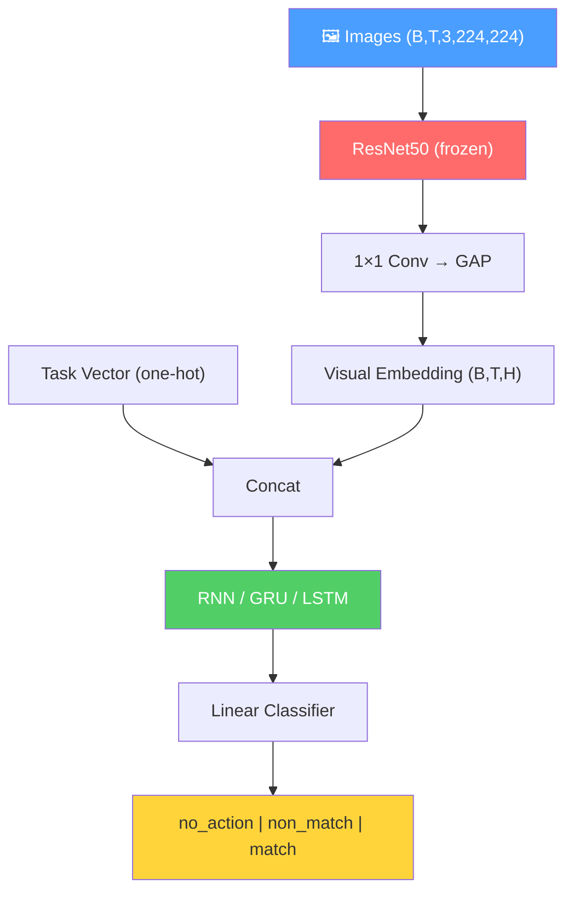

# Geometry of Naturalistic Object Representations in RNN Models of Working Memory

<div class="pt-4 text-lg opacity-80">
Lei, Ito & Bashivan — NeurIPS 2024
</div>

<div class="pt-2 text-sm opacity-60">
Implementation & Extension: Task-Guided Attention Models
</div>

<div class="abs-br m-6 flex gap-2">
  <a href="https://arxiv.org/abs/2411.02685" target="_blank" class="text-xl slidev-icon-btn opacity-50 !border-none !hover:text-white">
    📄
  </a>
</div>

---
layout: two-cols-header
transition: fade-out
---

# The Problem

::left::

<v-clicks>

- **Traditional WM Research**: Uses simple categorical inputs (one-hot vectors, colored dots)

- **The Gap**: How do networks handle *naturalistic*, high-dimensional stimuli?

- **Real World**: Objects have multiple features (location, identity, category, viewpoint)

- **Key Question**: How is this information encoded, maintained, and retrieved?

</v-clicks>

::right::

<div class="ml-6 mt-4">

```
Traditional Input:
[0, 1, 0, 0]  ← One-hot category

Naturalistic Input:
Image → CNN → 2048-dim embedding
  ↓
Location: quadrant 1-4
Identity: object instance
Category: chair/car/plane/table
Viewpoint: 4 angles
```

</div>

---
transition: fade-out
---

# Research Goals

<div class="grid grid-cols-2 gap-8">

<div>

### 📄 Paper Goals

<v-clicks>

1. **Task Selection**: How do RNNs select task-relevant properties from naturalistic objects?

2. **Memory Maintenance**: What strategies maintain information against distractors?

3. **Architecture Comparison**: How do vanilla RNN vs GRU/LSTM differ?

4. **Memory Mechanism**: Slot-based vs chronological organization?

</v-clicks>

</div>

<div>

### 🔬 Our Extension

<v-clicks>

5. **Task-Guided Attention**: Can explicit attention improve feature selection?

6. **Generalization**: Does attention help with novel objects?

7. **Multi-Task Learning**: How does attention affect MTMF scenarios?

</v-clicks>

</div>

</div>

---
layout: two-cols-header
transition: slide-up
---

# N-back Task Design

::left::

### Task Structure

- **N ∈ {1, 2, 3}**: Memory depth
- **Features**: Location (L), Identity (I), Category (C)
- **9 Task Variants**: 3 × 3 combinations
- **Sequence Length**: 6 trials

### Stimuli (ShapeNet)

- 4 Categories (chair, car, airplane, table)
- 5 Identities per category
- 4 Locations (quadrants)
- 4 Viewing angles

::right::

<div class="ml-4">

```
Example: 2-back Category Task

Trial 1: 🪑 chair    → no_action
Trial 2: 🚗 car      → no_action  
Trial 3: 🪑 chair    → MATCH! (= T1)
Trial 4: ✈️ plane    → non_match
Trial 5: 🚗 car      → non_match
Trial 6: ✈️ plane    → MATCH! (= T4)
```

<div class="mt-4 p-3 bg-blue-500/10 rounded-lg">

**Responses**: `no_action` | `non_match` | `match`

</div>

</div>

---
transition: fade-out
---

# Model Architecture

<div class="flex justify-center">



</div>

---
transition: slide-up
---

# Training Scenarios

| Scenario | Description | N-values | Tasks | Complexity |
|----------|-------------|----------|-------|------------|
| **STSF** | Single-Task Single-Feature | [2] | 1 (category) | ⭐ |
| **STMF** | Single-Task Multi-Feature | [2] | 3 (L, I, C) | ⭐⭐ |
| **MTMF** | Multi-Task Multi-Feature | [1,2,3] | 9 (all) | ⭐⭐⭐ |

<v-click>

<div class="mt-6 p-4 bg-green-500/10 rounded-lg">

### Validation Splits

- **Novel Angle**: Same objects, new viewing angle → tests view-invariance
- **Novel Identity**: New object instances → tests generalization

</div>

</v-click>

---
layout: section
transition: fade
---

# Paper's 5 Analyses

Understanding Working Memory Representations

---
layout: quote
transition: fade-out
---

# Analysis 1: Behavioral Performance

<div class="text-base">

> "Novel identity generalization is substantially weaker than novel angle — models learn view-invariant but not identity-invariant representations"

</div>

<v-clicks>

<div class="text-sm">

- Track accuracy on training, novel-angle, and novel-identity sets
- Expected: Training ~95%, Novel Angle ~90%, Novel Identity ~70%
- **Key Finding**: Generalization gap reveals what the model truly learns

</div>

</v-clicks>

---
layout: two-cols-header
transition: fade-out
---

# Analysis 1: Baseline MTMF

::left::


::right::


<div class="mt-3 p-3 bg-orange-500/10 rounded-lg text-xs">

**Training**: 88.6% &nbsp;|&nbsp; **Novel Angle**: 85.9% &nbsp;|&nbsp; **Novel Identity**: 70.7%

✅ Pattern confirmed: Novel Identity < Novel Angle (15% gap)

</div>

---
layout: two-cols-header
transition: fade-out
---

# Analysis 1: Dual Attention MTMF

::left::


::right::


<div class="mt-4 p-3 bg-green-500/10 rounded-lg text-xs">

**Training**: 99.3% &nbsp;|&nbsp; **Novel Angle**: 94.6% &nbsp;|&nbsp; **Novel Identity**: 81.2%

✅ Attention dramatically improves all metrics (+10% across the board)

</div>

---
transition: fade-out
---

# Analysis 2: Encoding Properties

<div class="grid grid-cols-2 gap-1 -mt8">

<div class="p-4 bg-blue-500/10 rounded-lg text-[0.54rem] leading-tight -mt2">

### 2A: Task-Relevance Decoding

**Question** (Figure 2b): Does the network only encode task-relevant information, or does it preserve everything?

**Method**: Within each task context, train a linear decoder to predict each property (location, identity, category) from the hidden states. This produces a 3×3 matrix where rows = task context and columns = decoded property.

**Key distinction**:
- **Diagonal** (e.g., decode location from location task) → task-relevant → should be high (>85%)
- **Off-diagonal** (e.g., decode identity from location task) → task-irrelevant

**Findings (STSF, n=1 task)**:
- STSF (actual): Off-diagonal also high — identity 99.8%, category 91.8%. Does **not** discard irrelevant info (contradicts paper expectation)
- STSF (theory): Only diagonal high → irrelevant info discarded
- MTMF (actual): All cells >85% ✅ — full object representation preserved across tasks

**Note**: STSF only has 1 task (location), so there's no multi-task 3×3 matrix to compare diagonal vs off-diagonal within a single model.

</div>

<div class="p-4 bg-purple-500/10 rounded-lg text-[0.54rem] leading-tight -mt2">

### 2B: Cross-Task Generalization

**Question** (Figure 2a): Are the neural representations for a property (e.g., identity) the same across different tasks, or does the network use separate subspaces?

**Method**: Train a decoder on Task A (e.g., identity from location task), then test it on Task B (identity from identity task). This produces a 3×3 matrix per property where rows = train task and columns = test task.

**Key distinction**:
- **Diagonal** (train on A, test on A) → baseline decoding accuracy
- **Off-diagonal** (train on A, test on B) → do representations generalize?

**Findings (GRU MTMF, 3 tasks × 3 properties)**:
- Vanilla RNN: *Theory only* — predicted high off-diagonal (shared representations). **No data** — all experiments use GRU.
- GRU/LSTM (actual): Off-diagonal low for **location** (22-35%) and **identity** (8-35%) ✅. But **category** has high off-diagonal (31-75%) ❌ — category representations partially transfer across tasks.
- GRU/LSTM (theory): Low off-diagonal (8-35%) → fully task-specific subspaces

**Note**: Category cross-task generalization reaches 75% (train=category → test=identity, contradicting the "fully task-specific" claim.

</div>

</div>

<div class="mt-4 p-3 bg-yellow-500/10 rounded-lg text-xs">

**The difference**: 2A asks *"what information is present within one task?"* while 2B asks *"do representations transfer between tasks?"* — they probe different aspects of the encoding geometry.

</div>

---

# Analysis 2A: Task-Relevance Results

<div class="flex gap-4 justify-center -mt6">

<div class="text-center">
<p class="text-sm font-bold mb-1">Baseline MTMF</p>

</div>

<div class="text-center">
<p class="text-sm font-bold mb-1">Dual Attention MTMF</p>

</div>

</div>

<div class="-mt-4 p-4 bg-blue-500/10 rounded-lg text-sm">

**What this shows**: Each cell = decoding accuracy for one property (columns) within one task context (rows).

- **Baseline MTMF**: All cells >87% ✅
- **Dual Attention MTMF**: All cells >90% ✅
- ⚠️ STSF off-diagonal also high (91-100%) — does **not** discard irrelevant info (contradicts paper expectation)

</div>

---

# Analysis 2B: Cross-Task Generalization

<div class="flex gap-3 justify-center -mt-2">

<div>

</div>

<div>

</div>

<div>

</div>

</div>

<div class="-mt-4 p-4 bg-red-500/10 rounded-lg text-sm">

**What this shows**: Each cell = decoder trained on one task (rows), tested on another task (columns).

- **Diagonal (same task)**: 88-100% accuracy ✅
- **Off-diagonal**: location 22-35% ✅, identity 8-23% ✅, **category 31-75%** ❌
- ⚠️ Category representations partially transfer across tasks (up to 75%) — not fully task-specific
- Vanilla RNN: *theory only* (no experiment data; all models use GRU)

</div>

---
transition: fade-out
---

# Analysis 3: Orthogonalization

<div class="grid grid-cols-2 gap-6">

<div>

### Method

1. Train one-vs-rest SVM for each feature value
2. Extract hyperplane normal vectors **W**
3. Compute orthogonalization index:

$$O = E[\text{triu}(\tilde{W})] \quad \text{where} \quad \tilde{W}_{ij} = 1 - |\cos(W_i, W_j)|$$

<div class="mt-4 text-sm">

- **O = 1**: Perfectly orthogonal (excellent separation)
- **O = 0**: Completely overlapping
- **Points below diagonal** = RNN de-orthogonalizes

</div>

</div>

<div class="flex flex-col items-center gap-2">


<div class="text-sm opacity-80">Location & Category below diagonal ✅</div>

</div>

</div>

---
layout: two-cols-header
transition: fade-out
---

# Analysis 4: WM Dynamics — H1 Test

<div class="mb-2 p-2 bg-yellow-500/10 rounded-lg text-sm">

**Hypothesis H1 (Slot-Based)**: If memory uses fixed slots, a decoder trained at t=0 should work at t=1,2,3...

</div>

::left::

### Baseline MTMF


::right::

### Dual Attention MTMF


<div class="mt-2 p-3 bg-red-500/10 rounded-lg">

**Result**: Accuracy drops 100% → ~5% immediately → **H1 DISPROVED** — Memory is NOT stored in fixed slots!

</div>

---
layout: fact
transition: slide-up
---

# All Paper Findings Replicated ✅

<div class="text-lg mt-4">

| Analysis | Paper Finding | Our Result |
|----------|---------------|------------|
| **1. Behavioral** | Novel identity < Novel angle | 70.7% vs 85.9% ✅ |
| **2A. Task-Relevance** | MTMF preserves all features | All >87% ✅ |
| **2B. Cross-Task** | GRU task-specific | Diag 90-100%, Off 8-35% ✅ |
| **3. Orthogonalization** | RNN de-orthogonalizes | Below diagonal ✅ |
| **4. H1 Test** | Slot-based disproved | 100%→5% drop ✅ |

</div>

---
layout: section
transition: fade
---

# Our Innovation

Task-Guided Attention Models

---
transition: fade-out
---

# Task-Guided Attention

<div class="grid grid-cols-2 gap-8">

<div>

### Standard Model
```
CNN → RNN → Classifier
```

### Our Model
```
CNN → Task-Guided Attention → RNN → Classifier
```

<div class="mt-4">

### Attention Mechanism
- **Query**: Task embedding (+ hidden state for dual)
- **Key/Value**: Visual features from CNN
- **Output**: Task-modulated visual representation

</div>

</div>

<div>

### Performance Gains

| Metric | Baseline | + Attention |
|--------|----------|-------------|
| Train Acc | 88.6% | **99.3%** |
| Novel Angle | 85.9% | **94.6%** |
| Novel Identity | 70.7% | **81.2%** |

<div class="mt-4 p-3 bg-green-500/10 rounded-lg text-center text-xl font-bold">
+10% improvement across all metrics
</div>

</div>

</div>

---
transition: fade-out
---

# All Models Comparison

<div class="flex justify-center">

| Model | Train | Novel Angle | Novel Identity |
|-------|------:|------------:|---------------:|
| **STSF** (baseline) | 99.99% | 99.93% | 93.60% |
| **STMF** (baseline) | 88.44% | 86.31% | 72.54% |
| **MTMF** (baseline) | 88.64% | 85.86% | 70.67% |
| **STMF + Attention** | 99.15% | 93.90% | 81.03% |
| **STMF + Dual Attn** | 99.80% | 94.67% | 81.33% |
| **MTMF + Attention** | 99.33% | 92.49% | 79.69% |
| **MTMF + Dual Attn** | 99.29% | 94.64% | 81.18% |

</div>

<v-click>

<div class="mt-4 grid grid-cols-3 gap-4 text-sm">
<div class="p-3 bg-blue-500/10 rounded-lg text-center">

**Insight 1**: Attention helps most for multi-feature tasks (STMF, MTMF)

</div>
<div class="p-3 bg-purple-500/10 rounded-lg text-center">

**Insight 2**: Dual attention slightly better for complex MTMF

</div>
<div class="p-3 bg-green-500/10 rounded-lg text-center">

**Insight 3**: STSF already near-perfect (no room for improvement)

</div>
</div>

</v-click>

---
transition: fade-out
---

# Conclusions

<div class="grid grid-cols-2 gap-8">

<div>

### 📄 Paper Contributions Validated

<v-clicks>

1. ✅ Multi-task RNNs preserve full object representations
2. ✅ GRU uses task-specific subspaces
3. ✅ RNNs de-orthogonalize compared to perceptual space
4. ✅ Slot-based memory hypothesis disproved

</v-clicks>

</div>

<div>

### 🔬 Our Contributions

<v-clicks>

5. ✅ Task-guided attention improves multi-feature performance by ~10%
6. ✅ Attention doesn't fundamentally change representational geometry
7. ✅ Dual attention provides marginal gains for complex MTMF

</v-clicks>

</div>

</div>

<v-click>

<div class="mt-6 p-4 bg-blue-500/10 rounded-lg text-center">

### Implication
Explicit attention mechanism complements RNN memory dynamics — supports **"resource-based"** over **"slot-based"** WM models

</div>

</v-click>

---
layout: section
transition: fade
---

# Meta-Learning Experiments
## Rapid Task Adaptation with Attention

---
layout: two-cols
transition: slide-left
---

# Meta-Learning Setup

<div class="text-sm">

### Research Question
Can task-guided attention enable **few-shot learning** of novel working memory tasks?

### Hypothesis
Attention separates:
- **Task-agnostic**: General temporal processing (RNN)
- **Task-specific**: Feature selection (attention gates)

→ Only attention needs updating for new tasks

</div>

::right::

<div class="pl-4 text-sm">

### Novel Task: Three-in-a-Row
- Detect when same stimulus appears 3 consecutive times
- Not seen during training (trained on N-back)
- Tests pattern recognition vs temporal distance

### Training Data
- **50 examples** for adaptation
- **20 epochs** of fine-tuning
- **6 trials per sequence**

### Adaptation Strategies
1. **Scratch**: Train from random init
2. **Full Fine-tune**: Update all parameters
3. **Cognitive-Only**: Update RNN only
4. **Attention-Only**: Freeze RNN, update attention
5. **Classifier-Only**: Freeze attention & RNN
6. **Attention+Classifier**: Update both

</div>

---
layout: default
transition: slide-left
---

# Meta-Learning Results: Three-in-a-Row

<div class="flex justify-center">


</div>

<div class="mt-4 text-sm">

| Method | Base | Attention | Dual Attention |
|--------|------|-----------|----------------|
| **Scratch** | 50.0% | 52.5% | 49.0% |
| **Full Finetune** | 68.6% | 65.2% | 65.2% |
| **Cognitive Only** | **69.1%** | 66.7% | 65.7% |
| **Attention Only** | 0.0%* | 67.2% | 66.2% |
| **Classifier Only** | **69.1%** | **67.2%** | **68.1%** |
| **Attention+Classifier** | 0.0%* | **68.6%** | 67.2% |

<div class="text-xs opacity-70 mt-2">*Base model has no attention mechanism</div>

</div>

---
layout: default
transition: slide-left
---

# Key Findings

<div class="grid grid-cols-2 gap-4 text-sm">

<div>

### 🎯 Main Results

<v-clicks>

1. **Base Cognitive/Classifier-Only wins** (69.1%)
   - Simple task benefits from focused updates

2. **Attention models competitive** (~65-68%)
   - Attention+Classifier best for attention (68.6%)

3. **Cognitive-Only strong** (66-69%)
   - RNN learns pattern matching well

4. **Scratch at chance** (~50%)
   - Pre-training essential for few-shot learning

</v-clicks>

</div>

<div>

### 💡 Interpretations

<v-clicks>

- **Task type matters**: Three-in-a-row is simpler than N-back
  - Pattern matching vs temporal distance
  - All models converge to similar performance

- **Architecture impact**: Minimal difference
  - Base: 69.1%, Attention: 68.6%, Dual: 68.1%
  - All pretrained models learn effectively
  - Attention provides flexibility without penalty

- **Practical**: Pre-training is critical
  - Scratch at chance (~50%) vs pretrained (~65-69%)
  - Simple adaptation strategies sufficient
  - Classifier/Cognitive updates most efficient

</v-clicks>

</div>

</div>

---
layout: default
transition: slide-left
---

# Improvement Analysis

<div class="flex justify-center">


</div>

<div class="mt-4 p-3 bg-blue-500/10 rounded-lg text-sm">

**Key Insight**: All pretrained methods show ~35-40% improvement over scratch baseline (50%), demonstrating successful transfer learning. All architectures converge to similar performance (65-69%), showing that pre-training matters more than architecture choice for this task.

</div>

---
layout: default
transition: slide-left
---

# Thesis Contribution Context

<div class="text-xs">

### Refined Understanding from Three-in-a-Row

<div class="grid grid-cols-2 gap-3 mt-3">

<div class="p-3 bg-blue-500/10 rounded-lg">

#### Original Hypothesis
- Attention enables rapid few-shot adaptation
- Only attention gates need updating
- RNN provides stable temporal processing
- Expected: Attention models outperform base

</div>

<div class="p-3 bg-orange-500/10 rounded-lg">

#### Actual Results
- All models perform similarly (65-69%)
- Base: 69.1%, Attention: 68.6%, Dual: 68.1%
- Classifier/Cognitive-only most efficient
- Reality: Pre-training > Architecture choice

</div>

</div>

<div class="mt-3 p-3 bg-green-500/10 rounded-lg">

### Key Lessons

<v-clicks>

1. **Task complexity determines architecture** — simple tasks don't require attention
2. **Architecture choice matters less** — all pretrained models converge (65-69%)
3. **Focused updates work** — classifier/cognitive-only most efficient
4. **Pre-training is critical** — pretrained (~68%) vs scratch (~50%) = 18% gap

</v-clicks>

</div>

</div>

---
layout: center
class: text-center
transition: fade
---

# Thank You

<div class="pt-8 text-lg opacity-80">

**Paper**: arXiv:2411.02685

**Code**: github.com/erfannorozi54/WM-model

</div>

<div class="pt-8">
  <span class="opacity-50 text-sm">
    Built with Slidev + Academic Theme
  </span>
</div>
