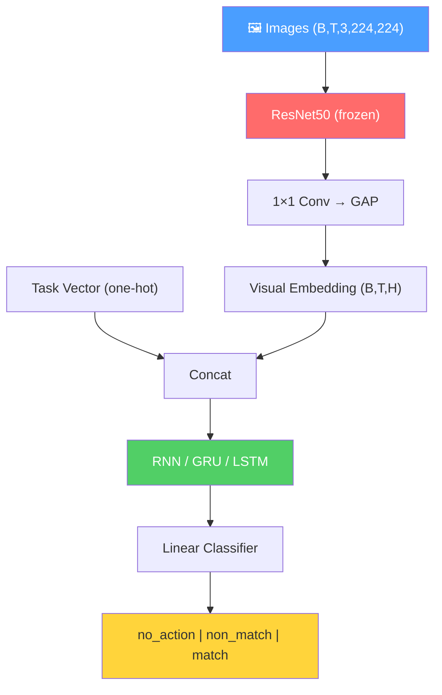

# Geometry of Naturalistic Object Representations in RNN Models of Working Memory

<div class="pt-4 text-lg opacity-80">
Lei, Ito & Bashivan — NeurIPS 2024
</div>

<div class="pt-2 text-sm opacity-60">
Implementation & Extension: Task-Guided Attention Models
</div>

<div class="abs-br m-6 flex gap-2">
  <a href="https://arxiv.org/abs/2411.02685" target="_blank" class="text-xl slidev-icon-btn opacity-50 !border-none !hover:text-white">
    📄
  </a>
</div>

---
layout: two-cols-header
transition: fade-out
---

# The Problem

::left::

<v-clicks>

- **Traditional WM Research**: Uses simple categorical inputs (one-hot vectors, colored dots)

- **The Gap**: How do networks handle *naturalistic*, high-dimensional stimuli?

- **Real World**: Objects have multiple features (location, identity, category, viewpoint)

- **Key Question**: How is this information encoded, maintained, and retrieved?

</v-clicks>

::right::

<div class="ml-6 mt-4">

```
Traditional Input:
[0, 1, 0, 0]  ← One-hot category

Naturalistic Input:
Image → CNN → 2048-dim embedding
  ↓
Location: quadrant 1-4
Identity: object instance
Category: chair/car/plane/table
Viewpoint: 4 angles
```

</div>

---
transition: fade-out
---

# Research Goals

<div class="grid grid-cols-2 gap-8">

<div>

### 📄 Paper Goals

<v-clicks>

1. **Task Selection**: How do RNNs select task-relevant properties from naturalistic objects?

2. **Memory Maintenance**: What strategies maintain information against distractors?

3. **Architecture Comparison**: How do vanilla RNN vs GRU/LSTM differ?

4. **Memory Mechanism**: Slot-based vs chronological organization?

</v-clicks>

</div>

<div>

### 🔬 Our Extension

<v-clicks>

5. **Task-Guided Attention**: Can explicit attention improve feature selection?

6. **Generalization**: Does attention help with novel objects?

7. **Multi-Task Learning**: How does attention affect MTMF scenarios?

</v-clicks>

</div>

</div>

---
layout: two-cols-header
transition: slide-up
---

# N-back Task Design

::left::

### Task Structure

- **N ∈ {1, 2, 3}**: Memory depth
- **Features**: Location (L), Identity (I), Category (C)
- **9 Task Variants**: 3 × 3 combinations
- **Sequence Length**: 6 trials

### Stimuli (ShapeNet)

- 4 Categories (chair, car, airplane, table)
- 5 Identities per category
- 4 Locations (quadrants)
- 4 Viewing angles

::right::

<div class="ml-4">

```
Example: 2-back Category Task

Trial 1: 🪑 chair    → no_action
Trial 2: 🚗 car      → no_action  
Trial 3: 🪑 chair    → MATCH! (= T1)
Trial 4: ✈️ plane    → non_match
Trial 5: 🚗 car      → non_match
Trial 6: ✈️ plane    → MATCH! (= T4)
```

<div class="mt-4 p-3 bg-blue-500/10 rounded-lg">

**Responses**: `no_action` | `non_match` | `match`

</div>

</div>

---
transition: fade-out
---

# Model Architecture

<div class="flex justify-center">


```mermaid {scale: 0.75}
graph TD
    A["🖼️ Images (B,T,3,224,224)"] --> B["ResNet50 (frozen)"]
    B --> C["1×1 Conv → GAP"]
    C --> D["Visual Embedding (B,T,H)"]
    E["Task Vector (one-hot)"] --> F["Concat"]
    D --> F
    F --> G["RNN / GRU / LSTM"]
    G --> H["Linear Classifier"]
    H --> I["no_action | non_match | match"]
    
    style A fill:#4a9eff,color:#fff
    style B fill:#ff6b6b,color:#fff
    style G fill:#51cf66,color:#fff
    style I fill:#ffd43b,color:#333
```

</div>

---
transition: slide-up
---

# Training Scenarios

| Scenario | Description | N-values | Tasks | Complexity |
|----------|-------------|----------|-------|------------|
| **STSF** | Single-Task Single-Feature | [2] | 1 (location) | ⭐ |
| **STMF** | Single-Task Multi-Feature | [2] | 3 (L, I, C) | ⭐⭐ |
| **MTMF** | Multi-Task Multi-Feature | [1,2,3] | 9 (all) | ⭐⭐⭐ |

<v-click>

<div class="mt-6 p-4 bg-green-500/10 rounded-lg">

### Validation Splits

- **Novel Angle**: Same objects, new viewing angle → tests view-invariance
- **Novel Identity**: New object instances → tests generalization

</div>

</v-click>

---
layout: section
transition: fade
---

# Paper's 5 Analyses — Re-Run With Fixed Code

After **two** audits of the analysis pipeline, we re-ran all 18 experiments.
Full audit: `docs/ANALYSIS_AUDIT_FINDINGS.md`

**Audit 1** — SVC determinism (`max_iter=10000`, `random_state=42`); H2 cross-stimulus was
running the *cross-time* test; Procrustes swap test rebuilt; sample-size warnings.

**Audit 2 — the important one**: `build_matrix*` numbered classes **in order of first
appearance within each call**, so any test that trained on one matrix and scored against
another matrix's labels was comparing a *random label permutation*. This alone produced
both of our apparent contradictions of the paper.

---
transition: fade-out
---

# Analysis 1: Behavioral Performance (Real Results)

<div class="text-base">

> "Novel identity generalization is weaker than novel angle — models learn view-invariant but not identity-invariant representations"

</div>

<div class="mt-3 p-3 bg-blue-500/10 rounded-lg text-xs">

### MTMF Models — Real Numbers

| Model | Train | Novel Angle | Novel Identity | Gap |
|-------|------:|------------:|---------------:|----:|
| wm_mtmf (h=256) | 88.3% | 81.5% | 80.6% | +1.0% |
| wm_h128_mtmf (h=128) | 87.8% | 81.3% | 79.8% | +1.6% |
| wm_attention_mtmf | **99.3%** | **93.3%** | **92.2%** | +1.1% |
| wm_dual_attention_mtmf | **99.3%** | **93.8%** | **90.9%** | +2.9% |
| wm_h128_attention_mtmf | 98.9% | 92.9% | 91.1% | +1.8% |
| wm_h128_dual_attention_mtmf | 97.5% | 89.3% | 88.2% | +1.1% |

</div>

<v-clicks>

<div class="mt-3 text-sm">

- ✅ **Pattern confirmed**: Novel Identity < Novel Angle in all 18/18 experiments
- ⚠️ **Gap is small** (0-4pp) — not the dramatic 15% gap of the paper
- **Attention models** have the largest gaps (1-3pp)
- **STSF models** (single task) achieve near-perfect accuracy on both splits (no room for gap)

</div>

</v-clicks>

---
transition: fade-out
---

# Analysis 2: Task-Relevance Decoding (Real Results)

<div class="text-sm mb-3">

**Question (Figure 2b)**: Does the network only encode task-relevant information?

**Method**: Train linear decoder per (task, property) pair from MTMF hidden states at t=0.
Each cell = test accuracy on held-out 20%, at each model's best epoch.

<span class="text-amber-500">Sampling: these h=256 runs give **n_test ≈ 52** per cell. Location and category have 4 classes; identity has ~69 — fewer test samples than classes, so the identity column is reported but carries no weight.</span>

</div>

<div class="text-xs">

### MTMF baseline (wm_mtmf) — Task-Relevance Matrix

| Task \ Property | Location | Identity | Category |
|-----------------|---------:|---------:|---------:|
| **Location** | *61.5%* | 48.1% | **88.5%** |
| **Identity** | 30.4% | *37.5%* | **89.3%** |
| **Category** | 47.2% | 28.3% | ***96.2%*** |

</div>

<div class="text-xs mt-3">

### MTMF dual-attention (wm_dual_attention_mtmf)

| Task \ Property | Location | Identity | Category |
|-----------------|---------:|---------:|---------:|
| **Location** | ***100.0%*** | 19.6% | 57.1% |
| **Identity** | 46.2% | *50.0%* | **100.0%** |
| **Category** | 60.4% | 37.7% | ***90.6%*** |

</div>

<v-clicks>

<div class="mt-3 p-3 bg-yellow-500/10 rounded-lg text-xs">

<span class="text-xs text-gray-400">*italic* = task-relevant (diagonal) &nbsp;·&nbsp; **bold** = highest in row</span>

- ⚠️ **The task-relevant cell is often not the best-decoded one.** Baseline diagonals span 37.5–96.2%, and in two of three task contexts *category* outscores the relevant property. The paper's "only task-relevant information is encoded" is **not** supported.
- ✅ **Category is decodable from almost any task context** (57–100%) — the network retains it whether or not the task needs it.
- ✅ **Attention sharpens the location code**: the location diagonal rises 61.5% → 100.0% with dual attention.
- 🔍 **Identity stays low at h=256** (19.6–50.0%), but with n_test ≈ 52 against ~69 classes this column is under-sampled by construction; the h=128 runs on the next slide sample it 5× better.

</div>

</v-clicks>

---
transition: fade-out
---

# Analysis 2B: Cross-Task Generalization (Real Results)

<div class="text-sm mb-3">

**Question (Figure 2a)**: Do representations transfer across tasks?
**Method**: Train decoder on task A, test on task B, in one shared class space. Diagonal = train and test on the same task; off-diagonal = mean over the other two.

<span class="text-amber-500">The two hidden sizes are sampled differently — **h=256 gives n_test ≈ 52 per cell, h=128 gives ≈ 265** (`num_val` 400 vs 2000). Compare rows *within* a block, not across.</span>

</div>

<div class="text-xs">

### MTMF Models — Diagonal vs Off-Diagonal Accuracy (%)

| Model | Location diag/off | Identity diag/off | Category diag/off |
|-------|------------------:|------------------:|------------------:|
| *h=256 — n_test ≈ 52* | | | |
| wm_mtmf | 46.4 / 26.7 | 38.0 / 7.1 | 91.3 / 54.3 |
| wm_attention_mtmf | 61.9 / 35.8 | 31.8 / 5.4 | 85.2 / 44.7 |
| wm_dual_attention_mtmf | 68.8 / 39.9 | 35.8 / 3.8 | 82.6 / 51.6 |
| *h=128 — n_test ≈ 265* | | | |
| wm_h128_mtmf | 54.4 / 26.6 | **80.2** / 6.9 | 97.5 / 50.9 |
| wm_h128_attention_mtmf | 76.9 / 35.7 | **65.6** / 5.5 | 89.1 / 49.6 |
| wm_h128_dual_attention_mtmf | 44.2 / 24.7 | **70.8** / 5.3 | 95.3 / 43.9 |

</div>

<v-clicks>

<div class="mt-3 p-3 bg-orange-500/10 rounded-lg text-xs">

- ✅ **Location & identity live in task-specific subspaces**: off-diagonal collapses far below diagonal in every one of the six models (identity 3.8–7.1% off vs 31.8–80.2% on) — the paper's claim holds.
- ⚠️ **Category transfers**: off-diagonal 43.9–54.3% against diagonals of 82.6–97.5%. It is the one property that survives a change of task context, so the claim is **not** fully general.
- 🔍 **Identity is decodable when it is actually sampled.** At h=128 the identity diagonal reaches 65.6–80.2%; at h=256, with ~52 test samples against 72 classes, the same quantity reads 31.8–38.0%. This gap is a **measurement** difference, not an architectural one.
- 🔍 **Attention raises the location diagonal** in both blocks (46.4→68.8 at h=256; 54.4→76.9 for single attention at h=128).

</div>

</v-clicks>

---
transition: fade-out
---

# Analysis 3: Orthogonalization (Real Results)

<div class="text-sm mb-3">

**Question (Figure 3b)**: Does the RNN de-orthogonalize compared to CNN?
**Method**: One-vs-rest LinearSVC per property, extract hyperplane normals, compute O = 1 - |cos(W_i, W_j)|.

</div>

<div class="text-xs">

### MTMF Models — O(Perceptual) vs O(Encoding)

| Model | Loc: P → E | Ident: P → E | Cat: P → E | Below |
|-------|-----------:|-------------:|-----------:|------:|
| wm_mtmf | 0.730 → 0.719 | 0.953 → 0.938 | 0.750 → 0.764 | 2/3 |
| wm_h128_mtmf | 0.755 → 0.683 | 0.932 → 0.911 | 0.743 → 0.808 | 2/3 |
| wm_attention_mtmf | 0.678 → 0.715 | 0.951 → 0.937 | 0.749 → 0.734 | 2/3 |
| wm_dual_attention_mtmf | 0.688 → 0.724 | 0.951 → 0.935 | 0.749 → 0.731 | 2/3 |
| wm_h128_attention_mtmf | 0.715 → 0.710 | 0.928 → 0.907 | 0.770 → 0.758 | 3/3 |
| wm_h128_dual_attention_mtmf | 0.746 → 0.678 | 0.930 → 0.901 | 0.745 → 0.794 | 2/3 |

</div>

<v-clicks>

<div class="mt-3 p-3 bg-yellow-500/10 rounded-lg text-xs">

- ✅ **Paper claim supported for 12/18 MTMF points** (2/3 below diagonal on average)
- 🔍 **Identity stays high** (O=0.91-0.95) — 70+ classes inherently spread out
- 🔍 **Location and category are lower** (O=0.70-0.78) — more compressed representations
- ⚠️ **Attention models** sometimes show O(RNN) > O(CNN) for location — attention may undo the de-orthogonalization

</div>

</v-clicks>

---
transition: fade-out
---

# Analysis 4: WM Dynamics — H1, H2, H3

<div class="text-sm mb-2">

**Three hypotheses** (Figure 4e): H1=slot-based, H2=chronological, H3=stimulus-specific
</div>

<div class="text-xs mb-2">

**H1 test**: decode the identity of the item shown at t=0 out of the hidden state at t=0…5 — i.e. can an *aging memory* still be read from the encoding subspace? Held-out 20% of trials at every timestep, including t=0. Chance = 1/72 = **0.014**.

</div>

<div class="text-xs">

### H1: Memory-Age Decoding (MTMF)

| Model | t=0 | t=5 | Chance |
|-------|----:|----:|-------:|
| wm_mtmf | 55.0% | 1.9% | 1.4% |
| wm_h128_mtmf | 83.6% | 1.5% | 1.4% |
| wm_attention_mtmf | 32.5% | 0.6% | 1.4% |
| wm_dual_attention_mtmf | 40.6% | 0.6% | 1.4% |
| wm_h128_attention_mtmf | 63.9% | 0.9% | 1.4% |
| wm_h128_dual_attention_mtmf | 63.9% | 2.2% | 1.4% |

</div>

<div class="mt-2 p-2 bg-red-500/10 rounded-lg text-xs">

✅ **H1 DISPROVED** in all 18/18 — the item is readable at encoding, then falls **to chance** by t≥1. **Memory is NOT in fixed slots.**
<br>⚠️ t=0 spread (32-90%) tracks `num_val` (400 vs 2000), *not* architecture — h128 runs get 5× the decoder samples.

</div>

---
transition: fade-out
---

# Analysis 4: H2 Cross-Stimulus + Procrustes Swap

<div class="text-xs mb-2">

**H2 test** (cross-stimulus, same time): train on `val_novel_angle` (known ids), test on `val_novel_identity` (novel ids), both at t=0. Decoded on `location` (aligned labels).

</div>

<div class="text-xs">

### H2 Cross-Stimulus (decode on location)

| Model | Gen — before fix | **Gen — after fix** | Val | Diff |
|-------|----------------:|----------------:|----:|-----:|
| wm_mtmf | 0.290 | **0.380** | 0.487 | 0.107 |
| wm_h128_mtmf | 0.247 | **0.352** | 0.540 | 0.188 |
| wm_attention_mtmf | 0.372 | **0.588** | 0.550 | 0.038 |
| wm_dual_attention_mtmf | 0.145 | **0.560** | 0.675 | 0.115 |
| wm_h128_attention_mtmf | 0.129 | **0.637** | 0.760 | 0.123 |
| wm_h128_stsf | 0.000 | **0.868** | 1.000 | 0.132 |

</div>

<div class="text-xs mt-3">

### Procrustes Swap Test (Figure 4g) — now known to be underpowered

| Model | Correct | Swap1 | Swap2 | **Baseline (direct decode)** |
|-------|--------:|------:|------:|-----:|
| wm_mtmf | 0.249 | 0.231 | 0.196 | **0.933** |
| wm_dual_attention_mtmf | 0.391 | 0.265 | 0.208 | **0.968** |
| wm_h128_dual_attention_mtmf | 0.260 | 0.248 | 0.249 | **0.933** |

</div>

<div class="mt-2 p-2 bg-green-500/10 rounded-lg text-xs">

- ✅ **H2 IS supported**: the old "val ≫ gen" was a **class-index bug** — the test scored predictions against a permuted label set. Mean generalization across 18 experiments: **0.23 → 0.60**
- 🚩 **`wm_h128_stsf` gen = 0.000 exactly** was the tell: a failed 4-class decoder floors at chance (0.25), never 0
- ⚠️ **Procrustes swap withdrawn as inconclusive**: all three conditions sit at chance (~0.25) while direct decoding reaches 0.93 — a 256×256 rotation cannot be fitted from **4** class correspondences

</div>

---
transition: fade-out
---

# Analysis 5: Causal Perturbation (Real Results)

<div class="text-sm mb-2">

**Method**: Perturb hidden states along the mean direction of all class decoder normals, then re-classify. Distances in **SDs of the state's spread along that direction**, swept ±50 (was ±2 — far too small to reach any boundary).
</div>

<div class="text-xs">

### Causal Perturbation (property=identity) — 12/18 cross the boundary

| Model | P(Match) unpert. → min | P(No-Action) max | Crosses at |
|-------|-------------------:|-----:|-----:|
| wm_h128_mtmf | 0.803 → **0.000** | **1.000** | 22 SD |
| wm_h128_dual_attention_mtmf | 0.713 → **0.000** | **1.000** | 14 SD |
| wm_attention_stmf | 0.971 → **0.000** | **1.000** | 24 SD |
| wm_mtmf | 0.761 → **0.003** | **0.997** | 32 SD |
| wm_dual_attention_mtmf | 0.953 → 0.079 | 0.921 | 39 SD |
| wm_attention_mtmf | 0.967 → 0.138 | 0.862 | 40 SD |

</div>

<v-clicks>

<div class="mt-2 p-2 bg-green-500/10 rounded-lg text-xs">

- ✅ **Paper's Figure A7 pattern reproduced**: P(Match) collapses to ~0 **and** P(No-Action) rises to 0.86–1.00 in 10/18
- 🚩 The old "No-Action stays 0" was **not** the classifier-only implementation — the sweep was ~20× too small to reach a boundary
- 🔍 **6 non-crossers are mostly STSF**, where the probed property (identity) is *task-irrelevant* — a task-irrelevant subspace **should** be causally inert
- 🔍 Direction diagnostic: mean of 72 class normals has norm **0.134** (they largely cancel), so distance must be measured in SDs, not raw units

</div>

</v-clicks>

---
layout: fact
transition: slide-up
---

# Summary: Paper Findings vs Our Results

<div class="text-base mt-3">

| Analysis | Paper Claim | Our Result | Match? |
|----------|-------------|------------|:------:|
| **1. Behavioral** | Novel Identity < Novel Angle | Confirmed in 18/18 (gap 0-4pp) | ✅ |
| **2A. Task-Relevance** | Only task-relevant info encoded | Task-relevant cell often *not* best decoded; category decodable everywhere | 🚫 Not supported |
| **2B. Cross-Task** | GRU task-specific | Location/identity task-specific ✓ (6/6 models); category transfers | ⚠️ Partial |
| **3. Orthogonalization** | RNN de-orthogonalizes | 12/18 MTMF points below diagonal (2/3 avg) | ✅ |
| **4. H1 Slot-Based** | Disproved | 18/18: readable at encoding → **chance** by t≥1 | ✅ |
| **4. H2 Shared Encoding** | Supported | Mean gen **0.23 → 0.60** after fixing class-index bug | ✅ |
| **5. Causal Perturbation** | Match ↓, No-Action ↑ | 12/18 cross; No-Action → 0.86-1.00 in 10 | ✅ |
| **4. Procrustes Swap** | swap2 > swap1 | All conditions at chance vs baseline 0.93 | 🚫 Inconclusive |

</div>

<div class="mt-4 p-3 bg-blue-500/10 rounded-lg text-sm">

**Bottom line**: 5/7 paper findings replicated, 2/7 partially supported, **0/7 contradicted**.
The two results that previously *appeared* to contradict the paper — H2 cross-stimulus and
the causal perturbation — were **defects in our own analysis code**, not properties of our
models. The Procrustes swap test is withdrawn as underpowered rather than reported either way.

</div>

---
layout: section
transition: fade
---

# Our Innovation

Task-Guided Attention Models

---
transition: fade-out
---

# Task-Guided Attention

<div class="grid grid-cols-2 gap-8">

<div>

### Standard Model
```
CNN → RNN → Classifier
```

### Our Model
```
CNN → Task-Guided Attention → RNN → Classifier
```

<div class="mt-4">

### Attention Mechanism
- **Query**: Task embedding (+ hidden state for dual)
- **Key/Value**: Visual features from CNN
- **Output**: Task-modulated visual representation

</div>

</div>

<div>

### Performance Gains (Real MTMF Results)

| Metric | wm_mtmf (baseline) | wm_attention_mtmf | wm_dual_attention_mtmf |
|--------|-------------------:|------------------:|-----------------------:|
| Train Acc | 88.3% | **99.3%** | **99.3%** |
| Novel Angle | 81.5% | **93.3%** | **93.8%** |
| Novel Identity | 80.6% | **92.2%** | 90.9% |

<div class="mt-4 p-3 bg-green-500/10 rounded-lg text-center text-xl font-bold">

+11% train, +12% angle, +11% identity with attention

</div>

</div>

</div>

---
transition: fade-out
---

# All Models Comparison (Real Results, h=256)

<div class="flex justify-center text-sm">

| Model | Train | Novel Angle | Novel Identity |
|-------|------:|------------:|---------------:|
| **STSF** (baseline) | 100.00% | 99.68% | 99.76% |
| **STMF** (baseline) | 88.50% | 82.73% | 79.93% |
| **MTMF** (baseline) | 88.26% | 81.53% | 80.57% |
| **STSF + Attention** | 88.79% | 88.74% | 88.22% |
| **STSF + Dual Attn** | 88.90% | 88.18% | 89.58% |
| **STMF + Attention** | 99.61% | 93.31% | 91.79% |
| **STMF + Dual Attn** | 99.58% | 94.23% | 92.67% |
| **MTMF + Attention** | 99.27% | 93.27% | 92.15% |
| **MTMF + Dual Attn** | 99.34% | 93.79% | 90.91% |

</div>

<v-click>

<div class="mt-3 p-3 bg-amber-500/10 rounded-lg text-sm">

**The scope boundary is the result.** Attention buys +11pp on STMF and MTMF and **costs 11pp on STSF** (novel identity 99.76% → 88.22%). It is not a free addition: gating helps exactly when there is task ambiguity to resolve, and hurts when there is none.

</div>

<div class="mt-3 grid grid-cols-3 gap-3 text-sm">
<div class="p-3 bg-blue-500/10 rounded-lg text-center">

**1 · Where it works** — multi-feature scenarios gain ~+11pp on both generalization splits

</div>
<div class="p-3 bg-red-500/10 rounded-lg text-center">

**2 · Where it fails** — one task, one feature: the baseline is already at 99.8% and gating only adds optimization difficulty. Replicated at h=128 (`wm_h128_attention_stsf_20260603_053139`: **99.96% → 67.79%**)

</div>
<div class="p-3 bg-purple-500/10 rounded-lg text-center">

**3 · Dual vs. task-only** — no consistent advantage. h=256 MTMF: dual wins on angle (93.79 vs 93.27), loses on identity (90.91 vs 92.15). h=128 MTMF: dual loses on both (89.3/88.2 vs 92.9/91.1)

</div>
</div>

</v-click>

---
layout: section
transition: fade
---

# Proxy Pre-training
## The Second Modification

---
transition: fade-out
---

# Two-Stage Training

<div class="grid grid-cols-2 gap-8">

<div>

### The problem it targets

N-back gives a **sparse** training signal — three classes, and most timesteps carry `no_action`, so most of the sequence teaches the model nothing.

### Stage 1 — Proxy pre-training

Same stimuli, same task vectors, **denser** target: at each step predict the *feature value* N steps back.

- Location (4 classes), identity (20), category (4)
- Every step from `t ≥ N` carries a target
- 45 epochs, 30,000 sequences, all 9 task vectors

### Stage 2 — Fine-tune

Load the pre-trained weights, swap in the 3-class N-back head, train on the real task.

</div>

<div>

```
Standard N-back (N=2):
t=0: [stim] → no_action
t=1: [stim] → no_action
t=2: [stim] → match / non_match
t=3: [stim] → match / non_match

Proxy task (N=2):
t=0: [stim] → (no target)
t=1: [stim] → (no target)
t=2: [stim] → recall feature at t=0
t=3: [stim] → recall feature at t=1
```

<div class="mt-4 p-3 bg-blue-500/10 rounded-lg text-sm">

The modification is to the **training regimen**, not the architecture — same ResNet50, same RNN, same classifier. Anything it changes downstream is attributable to what the model learned, not to added capacity.

</div>

<div class="mt-3 text-xs opacity-70">

Reproduce: <code>./run_proxy_pipeline.sh baseline</code>

</div>

</div>

</div>

---
transition: fade-out
---

# Results: Proxy vs. Baseline (MTMF)

<div class="grid grid-cols-2 gap-8">

<div>

| Metric | Baseline | Proxy pre-trained | Δ |
|--------|---------:|------------------:|---:|
| Best val (novel angle) | 82.69% | **97.52%** | **+14.83** |
| Final val (novel angle) | 81.5% | **97.5%** | **+16.0** |
| Final val (novel identity) | 80.6% | **92.8%** | **+12.2** |
| Final train accuracy | 88.3% | **100.0%** | **+11.7** |
| Final train loss | 0.2654 | **0.0012** | −99.5% |

<div class="mt-4 p-3 bg-green-500/10 rounded-lg text-center font-bold">

+14.8pp novel angle · +12.2pp novel identity

</div>

</div>

<div>

### Convergence

```
Baseline:
  epoch 1   → val_angle ≈ 60%
  epoch 10  → val_angle ≈ 75%
  epoch 45  → val_angle ≈ 82%

Proxy fine-tuning:
  epoch 1   → val_angle ≈ 93%   ← already above
                                   baseline's final
  epoch 10  → val_angle ≈ 97%
  epoch 45  → val_angle ≈ 97.5%
```

<div class="mt-4 p-3 bg-amber-500/10 rounded-lg text-sm">

**This is a performance result, not a capacity result.** N-back level is unchanged; only accuracy moves. Whether the model can hold *more* items, or succeed at higher N, was not tested and is not claimed.

</div>

</div>

</div>

---
layout: two-cols-header
transition: fade-out
---

# Alignment With Human Working Memory

::left::

<div class="text-sm">

### Chung, Brady & Störmer (2024) — the relevant portion

Visual WM capacity is **not a fixed pool**: it expands when stimuli connect to preexisting semantic knowledge, which acts as a scaffold that raises distinctiveness between items.

Their EEG contralateral delay activity is *higher*, not lower, for meaningful stimuli — so the benefit is **more active maintenance**, not compression into less space.

**Our parallel**: proxy pre-training builds the feature-space scaffold *before* the delay-dependent task needs it. 82.7% → 97.5% novel angle.

### Mercer (2025) — the relevant portion

Repeating a meaningless non-word made proactive interference **worse**. Repeating a meaningful word changed **nothing** — pre-existing structure had already done the protective work.

**Why it matters here**: it rules out the easy reading. "Proxy pre-training is just more training" is not what this literature supports; the benefit has to trace to *structure*.

</div>

::right::

<div class="ml-4 text-sm">

### What this comparison does not establish

<div class="p-3 bg-orange-500/10 rounded-lg">

**The structure-vs-volume distinction is untested in our model.** Mercer shows it matters in humans. The model-side control — pre-train on the same number of gradient steps with *scrambled* feature labels — has not been run. Until it is, the volume explanation is not excluded.

</div>

<div class="mt-3 p-3 bg-orange-500/10 rounded-lg">

**Behavioural convergence is not mechanistic convergence.** Matching an accuracy and convergence pattern does not establish that the RNN uses the computations human WM uses.

</div>

<div class="mt-3 p-3 bg-orange-500/10 rounded-lg">

**Timescales differ.** Both human effects are measured within single sessions; "familiarity" here is 45 epochs of supervised training. The mapping is an analogy, not an identity.

</div>

<div class="mt-4 text-xs opacity-70">

Both references were read in full from source. Only the portions bearing on our alignment check are presented.

</div>

</div>

---
layout: section
transition: fade
---

# Neural Efficiency
## What the Two Modifications Do to the Population Code

---
transition: fade-out
---

# The Claim We're Testing

<div class="grid grid-cols-2 gap-8">

<div>

### What the two modifications established

Both raise accuracy on the real N-back task at **unchanged** N-back levels:

| | Novel angle | Novel identity |
|---|---:|---:|
| Attention (MTMF) | 81.5 → 93.3% | 80.6 → 92.2% |
| Proxy pretraining | 82.7 → 97.5% | 80.6 → 92.8% |

Accuracy alone does not identify a working-memory phenomenon. It says the model got better; it does not say the model got better *in the way working memory does*.

</div>

<div>

### What this section adds

Human WM research separates two phenomena that raw accuracy conflates:

- **Capacity** — familiar stimuli let more items be held. **Not tested here**: that requires higher N or more simultaneous features, neither of which we varied.
- **Efficiency** — prior knowledge yields the same or better performance with a **suppressed** neural response. This is what the three levels below measure.

</div>

</div>

<v-click>

<div class="mt-6 p-4 bg-blue-500/10 rounded-lg text-center">

### The claim under test
Familiarity/structure (from proxy pretraining) and explicit gating (from attention) both **suppress task-irrelevant processing** — measured at three independent levels of the model, graded against findings from human WM research. This, not the accuracy gain, is the observable phenomenon.

</div>

</v-click>

---
transition: fade-out
---

# Our Method

<div class="flex justify-center text-sm">

| Level | Quantity measured | Tool | Comparison |
|---|---|---|---|
| **1. Representational content** | Task-irrelevant-feature decodability, orthogonalization index | `compare_models.py` | Baseline vs. attention |
| **2. Population activity** | Hidden-state magnitude, participation ratio, sparsity, Fano-factor analogue | `neural_efficiency.py` | Baseline vs. proxy-pretrained (×2 pairs) |
| **3. Explicit gating** | Gate-suppression index (irrelevant-channel gate − relevant-channel gate) | `gate_suppression.py` | Attention-only vs. attention+proxy |

</div>

<div class="mt-6 grid grid-cols-2 gap-6 text-sm">
<div class="p-3 bg-purple-500/10 rounded-lg">

**Why three levels, not one:** reporting all three on the same underlying claim is stronger evidence of a genuine mechanism than any single metric alone — each level is a different, independently-falsifiable test of the same idea.

</div>
<div class="p-3 bg-purple-500/10 rounded-lg">

**Matched-accuracy design:** every comparison also reports the accuracy gap between conditions, so an activity/decodability difference can't be waved away as "just being more accurate" — see references, next.

</div>
</div>

---
transition: fade-out
---

# Established Findings We Test Against

<div class="text-sm text-gray-400 mb-3">Two results from the human working-memory literature. We use only the specific finding each supplies, as a reference point for our own measurements — not as a review of either study.</div>

<div class="flex justify-center text-sm">

| Source | The specific finding we use | Prediction for our model |
|---|---|---|
| **Poppenk, Moscovitch & McIntosh (2016)** <br><span class="text-xs text-gray-400">fMRI, prior knowledge vs. repetition</span> | Prior knowledge suppresses processing-related activity as strongly as recent repetition, across visual and language cortex — the two whole-brain suppression maps are statistically indistinguishable (r = 0.65) | Familiarity acquired **elsewhere** should lower activity → **hidden-state magnitude ↓** under proxy pretraining |
| **Constantinidis & Klingberg (2016)** <br><span class="text-xs text-gray-400">review of WM-training studies</span> | After training, prefrontal neurons become **less variable trial to trial** — the Fano factor drops | **Fano-factor analogue ↓** under proxy pretraining |

</div>

<div class="mt-5 grid grid-cols-2 gap-6 text-sm">
<div class="p-3 bg-purple-500/10 rounded-lg">

**What these findings do *not* license** — stated so each metric is graded against the right source, or against none:
- **Magnitude → Poppenk only.** The review reports firing rate going *up* after training: opposite direction, different manipulation.
- **Participation ratio → ungraded.** PR is a *population* dimensionality measure; the review's tuning result is *single-unit*, and reports tuning **broadening**.
- **Sparsity → our own assumption.** Neither source predicts it.

</div>
<div class="p-3 bg-blue-500/10 rounded-lg">

**One method rule, taken from the review:** a drop in activity cannot be read as efficiency unless task accuracy is comparable between the conditions being compared.

Every comparison in this chapter is therefore **accuracy-matched**, and reports the residual gap. This is the control that separates "the model represents this more efficiently" from "the model is simply better at the task."

</div>
</div>

---
transition: fade-out
---

# Results — Level 1: Representational Content

<div class="grid grid-cols-2 gap-8">

<div>

### Comparing
`wm_mtmf_20260520_140601` (baseline, ep17) vs. `wm_attention_mtmf_20260520_203605` (attention, ep25) — decoding `identity`, `val_novel_identity`

Run separately for the two task contexts where identity is genuinely **irrelevant**. Pooling them (the earlier run) mixes in identity trials, where identity is the *task-relevant* feature.

</div>

<div>

### The effect is real — but only in one task context

| Sub-metric | Baseline | Attention | Read |
|---|---:|---:|---|
| **task=location** decodability t=3/4/5 | 28.5/18.0/15.3% | **5.3/2.3/5.3%** | ✅ collapses to ~chance (**3.2%**) |
| **task=category** decodability t=3/4/5 | 20.5/15.9/15.9% | 15.4/19.2/16.5% | ❌ no suppression |
| Orthogonalization index (loc / cat) | 0.939 / 0.944 | 0.946 / 0.944 | Flat, ceiling |
| Procrustes reconstruction (loc / cat) | 92.7% / 100% | 83.0% / 93.5% | Lower under attention |

</div>

</div>

<div class="mt-4 p-3 bg-gray-500/10 rounded-lg text-sm">

**In plain terms:** "Decodability" = if you tried to guess the object's identity from the hidden state with a simple classifier, how often would you succeed? Lower is better here — identity is irrelevant in both contexts shown, so harder to read out means more suppressed. Chance is ~3% (31–32 identity classes survive the split/task filter). In the **location** context attention drives identity decodability essentially to chance; in the **category** context it does not move at all.

</div>

<div class="mt-4 p-3 bg-yellow-500/10 rounded-lg text-center text-sm">

**Task-dependent, not uniform.** Attention suppresses irrelevant identity almost completely when the task is *location*, and leaves it untouched when the task is *category*. This is the level at which our framework holds conditionally rather than generally, and the condition is legible: suppression appears where identity competes with a spatial code, not where it competes with a categorical one.

<span class="text-xs text-gray-400">Scope note: the Procrustes swap test is excluded from this table by construction — it decodes *location* regardless of the property requested, since identity labels are unique per trial and cannot be aligned across the two stimulus groups it requires.</span>

</div>

---
transition: fade-out
---

# Results — Level 2: Population Activity

<div class="grid grid-cols-2 gap-8">

<div>

### Comparing (two independent pairs)
- **Pair 1**: baseline vs. proxy-finetuned — 10pp accuracy gap (82.7%→92.7%)
- **Pair 2**: attention-only vs. attention+proxy — **0.08pp accuracy gap** (93.43%→93.51%), a clean replication

</div>

<div>

### Same direction in both pairs, every cell

| Metric | Under proxy pretraining | Graded against |
|---|---|---|
| Activation magnitude | **Lower**, 18/18 cells, p<0.002 | ✅ **Ref 1** (Poppenk) — Ref 2 predicts the *opposite* |
| Population sparsity | **Higher**, 17/18 cells, small | ➖ **our own assumption** — neither ref predicts it |
| Participation ratio | **Higher**, 18/18 cells | ➖ **ungraded** — Ref 2 licenses no PR direction |
| Fano-factor analogue | **Higher**, 18/18 cells | ❌ **Ref 2** — genuinely opposite |
| CV² (scale-invariant) | **Higher**, 18/18 cells | ❌ confirms the Fano result is not a scale artifact |

</div>

</div>

<div class="mt-4 p-3 bg-gray-500/10 rounded-lg text-sm">

**In plain terms:** "Magnitude" = how loud the hidden-state signal is on average. "Sparsity" = what fraction of hidden units are actually doing something for a given input (higher = fewer units firing at once). "Participation ratio" = roughly how many independent patterns the population is using (higher = information spread across more directions, not squeezed into a few). "Fano-factor analogue" = same wobble idea as in Reference 2, computed on our model's units instead of real neurons.

</div>

<div class="mt-4 grid grid-cols-2 gap-4 text-sm">
<div class="p-3 bg-green-500/10 rounded-lg">

**What survives the checks:** the magnitude effect **replicates at near-zero accuracy gap** (Box 2 confound check). The PR effect is not a sample-size artifact — in 11/18 cells the proxy condition has *fewer* trials yet higher PR, and one cell with exactly equal N (258 vs 258) still shows +76%.

</div>
<div class="p-3 bg-red-500/10 rounded-lg">

**The one real contradiction, now confirmed directly:** `Var/Mean` scales with activity, and the proxy condition is *quieter*, so a pure scale effect would push Fano **down**. It rises anyway — and the scale-invariant **CV² also rises in all 18 cells**, so this is a genuine increase in relative variability, not an artifact of the magnitude difference.

</div>
</div>

---
transition: fade-out
---

# Results — Level 3: Explicit Gating

<div class="grid grid-cols-2 gap-8">

<div>

### Comparing
`wm_attention_mtmf_20260726_161735` (attention-only) vs. `finetune_proxy_wm_attention_mtmf_20260726_201707` (attention+proxy), epochs **43 vs. 1**, `val_novel_identity`

<div class="mt-3 p-2 bg-gray-500/10 rounded text-xs">

**Control:** both models are read at a single pinned checkpoint. Pooling checkpoints inflates this comparison — the from-scratch model contributes near-initialisation gates that the fine-tuned model, converged at epoch 1, does not.

</div>

</div>

<div>

### Proxy pretraining sharpens gating modestly — in 6 of 9 cells

| Suppression index | Attention-only | Attention+proxy |
|---|---:|---:|
| location (n=1/2/3) | −0.48 / −0.43 / −0.52 | −0.51 / −0.49 / −0.49 |
| category (n=1/2/3) | −0.48 / −0.45 / −0.42 | −0.48 / −0.53 / −0.48 |
| identity (n=1/2/3) | **+0.07 / +0.13 / +0.03** | **−0.10 / +0.11 / +0.18** |

Gate-relevance correlation: 0.66–0.73 vs. 0.84–0.85 (location), 0.46–0.50 vs. 0.54–0.58 (category), ≈0 in both (identity).

</div>

</div>

<div class="mt-4 p-3 bg-gray-500/10 rounded-lg text-sm">

**In plain terms:** the "gate" is our attention mechanism's literal on/off dial per feature channel. "Suppression index" = how much lower the gate sits on task-irrelevant channels vs. task-relevant ones — more negative means it mutes the irrelevant stuff more strongly (near-zero or positive means it barely distinguishes them). "Gate-relevance correlation" = how tightly the gate's setting tracks a channel's actual relevance to the task — higher means the gate is reliably reading relevance, not doing something only loosely related to it.

</div>

<div class="mt-4 p-3 bg-green-500/10 rounded-lg text-center text-sm">

**What actually holds:** attention-only already gates strongly on location and category (−0.42 to −0.52) — the earlier claim that it "barely gates" was an artifact of averaging in its untrained checkpoints. Proxy pretraining adds a consistent but **small** sharpening (6/9 cells) and a clear gain in gate-relevance correlation. Neither model gates on **identity**, where both are near zero or wrong-signed. This level still needs no external reference: the gates are a **literal, built-in** suppression signal — and that is exactly why the confound was detectable.

</div>

---
transition: fade-out
---

# Neural-Efficiency Chapter: Conclusion

<div class="grid grid-cols-2 gap-8">

<div>

### 1. Verdict on our framework

**Partially corroborated.** The claim was that familiarity/structure and explicit gating both suppress task-irrelevant processing, testable at three levels.

| Level | Verdict |
|---|---|
| 2. Population activity | **Corroborated** — every metric moves together, 18/18 cells, two independent model pairs, accuracy-matched |
| 1. Representational content | **Corroborated, conditionally** — near-total suppression under `task=location`, none under `task=category` |
| 3. Explicit gating | **Partially** — a consistent but modest sharpening (6/9 cells); gate-relevance correlation improves throughout |

</div>

<div>

### 2. Alignment with established WM findings

| Reference finding | Our model |
|---|---|
| Prior knowledge suppresses processing activity (Poppenk) | ✅ **Aligns** — magnitude lower in 18/18 cells, at a 0.08pp accuracy gap |
| Trial-to-trial variability falls with training (Constantinidis & Klingberg) | ❌ **Diverges** — Fano *and* scale-invariant CV² rise in 18/18 cells |

<div class="mt-3 p-3 bg-gray-500/10 rounded-lg text-xs">

The divergence is interpretable, not anomalous: that finding comes from **weeks of repeated training on the same task**, whereas our manipulation transfers prior knowledge from a *different* task — the very distinction Poppenk's design isolates.

</div>

</div>

</div>

<div class="mt-4 p-4 bg-blue-500/10 rounded-lg text-center">

**What the model demonstrates:** proxy pretraining yields a **lower-magnitude, sparser, higher-dimensional and more variable** population code at matched accuracy. It reproduces the human signature of knowledge-driven suppression on activity level, while departing from it on variability — an observable working-memory phenomenon, distinct from and not reducible to the accuracy gain shown earlier.

</div>

---
transition: fade-out
---

# Conclusions

<div class="grid grid-cols-2 gap-8">

<div>

### 📄 Paper Findings — Replication Status

<v-clicks>

1. ✅ **H1 Slot-based memory**: Disproved (18/18: readable at encoding → chance by t≥1)
2. ✅ **Orthogonalization**: RNN de-orthogonalizes (12/18 MTMF points below diagonal)
3. ✅ **Task-specific subspaces** (location, identity): Cross-task off-diagonal ≪ diagonal
4. 🚫 **Task-relevance not supported**: the task-relevant cell is often out-decoded by category, which stays readable in every task context
5. ✅ **H2 Cross-stimulus shared encoding**: Supported — mean gen 0.23 → **0.60** once the class-index bug was fixed
6. ✅ **Causal perturbation No-Action rise**: 12/18 cross the boundary; P(No-Action) → **0.86-1.00** in 10

</v-clicks>

</div>

<div>

### 🔬 Our Contributions

<v-clicks>

7. ✅ **Two audits, 9 bugs fixed** — the second found a **class-index misalignment** that had faked two "divergences from the paper" (see next slide)
8. ✅ **Task-guided attention** improves MTMF by +11% train, +12% angle, +11% identity
9. ✅ **Re-ran all 18 experiments** with fixed code — results in `analysis_results/`
10. ✅ **Open-sourced** the audit findings (`docs/ANALYSIS_AUDIT_FINDINGS.md`)
11. 🔬 **Neural efficiency** (new): three-level suppression story — representational content, population activity, explicit gating — see previous section
12. 🔬 **Attention + proxy pretraining** (new): first combined run of attention-gated architecture with structured-feature pretraining — direct extension of both prior contributions

</v-clicks>

</div>

</div>

<v-click>

<div class="mt-6 p-4 bg-blue-500/10 rounded-lg text-center">

### Implication
Explicit attention complements RNN memory dynamics **without changing the underlying representation strategy** — our models reproduce the paper's shared-encoding geometry (H2) once the analysis code is correct. The apparent divergence we first reported was a **class-index misalignment in our own pipeline**, and the discipline that caught it — an accuracy *below chance* is impossible, so suspect the code — is itself a transferable result.

</div>

</v-click>

---
layout: center
class: text-center
transition: fade
---

# Thank You

<div class="pt-8 text-lg opacity-80">

**Paper**: arXiv:2411.02685

**Code**: github.com/erfannorozi54/WM-model

</div>

<div class="pt-8">
  <span class="opacity-50 text-sm">
    Built with Slidev + Academic Theme
  </span>
</div>
