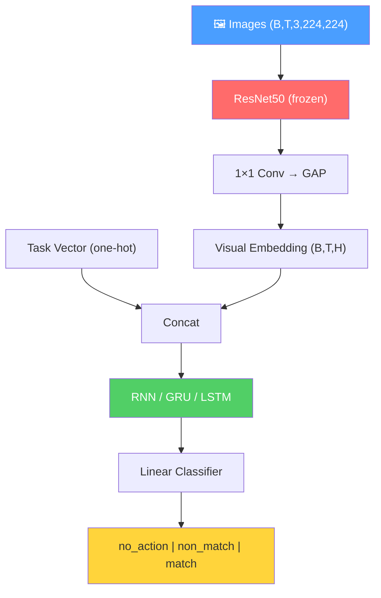

# Geometry of Naturalistic Object Representations in RNN Models of Working Memory

<div class="pt-4 text-lg opacity-80">
Lei, Ito & Bashivan — NeurIPS 2024
</div>

<div class="pt-2 text-sm opacity-60">
Implementation & Extension: Task-Guided Attention Models
</div>

<div class="abs-br m-6 flex gap-2">
  <a href="https://arxiv.org/abs/2411.02685" target="_blank" class="text-xl slidev-icon-btn opacity-50 !border-none !hover:text-white">
    📄
  </a>
</div>

---
layout: two-cols-header
transition: fade-out
---

# The Problem

::left::

<v-clicks>

- **Traditional WM Research**: Uses simple categorical inputs (one-hot vectors, colored dots)

- **The Gap**: How do networks handle *naturalistic*, high-dimensional stimuli?

- **Real World**: Objects have multiple features (location, identity, category, viewpoint)

- **Key Question**: How is this information encoded, maintained, and retrieved?

</v-clicks>

::right::

<div class="ml-6 mt-4">

```
Traditional Input:
[0, 1, 0, 0]  ← One-hot category

Naturalistic Input:
Image → CNN → 2048-dim embedding
  ↓
Location: quadrant 1-4
Identity: object instance
Category: chair/car/plane/table
Viewpoint: 4 angles
```

</div>

---
transition: fade-out
---

# Research Goals

<div class="grid grid-cols-2 gap-8">

<div>

### 📄 Paper Goals

<v-clicks>

1. **Task Selection**: How do RNNs select task-relevant properties from naturalistic objects?

2. **Memory Maintenance**: What strategies maintain information against distractors?

3. **Architecture Comparison**: How do vanilla RNN vs GRU/LSTM differ?

4. **Memory Mechanism**: Slot-based vs chronological organization?

</v-clicks>

</div>

<div>

### 🔬 Our Extension

<v-clicks>

5. **Task-Guided Attention**: Can explicit attention improve feature selection?

6. **Generalization**: Does attention help with novel objects?

7. **Multi-Task Learning**: How does attention affect MTMF scenarios?

</v-clicks>

</div>

</div>

---
layout: two-cols-header
transition: slide-up
---

# N-back Task Design

::left::

### Task Structure

- **N ∈ {1, 2, 3}**: Memory depth
- **Features**: Location (L), Identity (I), Category (C)
- **9 Task Variants**: 3 × 3 combinations
- **Sequence Length**: 6 trials

### Stimuli (ShapeNet)

- 4 Categories (chair, car, airplane, table)
- 5 Identities per category
- 4 Locations (quadrants)
- 4 Viewing angles

::right::

<div class="ml-4">

```
Example: 2-back Category Task

Trial 1: 🪑 chair    → no_action
Trial 2: 🚗 car      → no_action  
Trial 3: 🪑 chair    → MATCH! (= T1)
Trial 4: ✈️ plane    → non_match
Trial 5: 🚗 car      → non_match
Trial 6: ✈️ plane    → MATCH! (= T4)
```

<div class="mt-4 p-3 bg-blue-500/10 rounded-lg">

**Responses**: `no_action` | `non_match` | `match`

</div>

</div>

---
transition: fade-out
---

# Model Architecture

<div class="flex justify-center">


```mermaid {scale: 0.75}
graph TD
    A["🖼️ Images (B,T,3,224,224)"] --> B["ResNet50 (frozen)"]
    B --> C["1×1 Conv → GAP"]
    C --> D["Visual Embedding (B,T,H)"]
    E["Task Vector (one-hot)"] --> F["Concat"]
    D --> F
    F --> G["RNN / GRU / LSTM"]
    G --> H["Linear Classifier"]
    H --> I["no_action | non_match | match"]
    
    style A fill:#4a9eff,color:#fff
    style B fill:#ff6b6b,color:#fff
    style G fill:#51cf66,color:#fff
    style I fill:#ffd43b,color:#333
```

</div>

---
transition: slide-up
---

# Training Scenarios

| Scenario | Description | N-values | Tasks | Complexity |
|----------|-------------|----------|-------|------------|
| **STSF** | Single-Task Single-Feature | [2] | 1 (location) | ⭐ |
| **STMF** | Single-Task Multi-Feature | [2] | 3 (L, I, C) | ⭐⭐ |
| **MTMF** | Multi-Task Multi-Feature | [1,2,3] | 9 (all) | ⭐⭐⭐ |

<v-click>

<div class="mt-6 p-4 bg-green-500/10 rounded-lg">

### Validation Splits

- **Novel Angle**: Same objects, new viewing angle → tests view-invariance
- **Novel Identity**: New object instances → tests generalization

</div>

</v-click>

---
layout: section
transition: fade
---

# Paper's 5 Analyses — Re-Run With Fixed Code

After **two** audits of the analysis pipeline, we re-ran all 18 experiments.
Full audit: `docs/ANALYSIS_AUDIT_FINDINGS.md`

**Audit 1** — SVC determinism (`max_iter=10000`, `random_state=42`); H2 cross-stimulus was
running the *cross-time* test; Procrustes swap test rebuilt; sample-size warnings.

**Audit 2 — the important one**: `build_matrix*` numbered classes **in order of first
appearance within each call**, so any test that trained on one matrix and scored against
another matrix's labels was comparing a *random label permutation*. This alone produced
both of our apparent contradictions of the paper.

---
transition: fade-out
---

# Analysis 1: Behavioral Performance (Real Results)

<div class="text-base">

> "Novel identity generalization is weaker than novel angle — models learn view-invariant but not identity-invariant representations"

</div>

<div class="mt-3 p-3 bg-blue-500/10 rounded-lg text-xs">

### MTMF Models — Real Numbers

| Model | Train | Novel Angle | Novel Identity | Gap |
|-------|------:|------------:|---------------:|----:|
| wm_mtmf (h=256) | 88.3% | 81.5% | 80.6% | +1.0% |
| wm_h128_mtmf (h=128) | 87.8% | 81.3% | 79.8% | +1.6% |
| wm_attention_mtmf | **99.3%** | **93.3%** | **92.2%** | +1.1% |
| wm_dual_attention_mtmf | **99.3%** | **93.8%** | **90.9%** | +2.9% |
| wm_h128_attention_mtmf | 98.9% | 92.9% | 91.1% | +1.8% |
| wm_h128_dual_attention_mtmf | 97.5% | 89.3% | 88.2% | +1.1% |

</div>

<v-clicks>

<div class="mt-3 text-sm">

- ✅ **Pattern confirmed**: Novel Identity < Novel Angle in all 18/18 experiments
- ⚠️ **Gap is small** (0-4pp) — not the dramatic 15% gap of the paper
- **Attention models** have the largest gaps (1-3pp)
- **STSF models** (single task) achieve near-perfect accuracy on both splits (no room for gap)

</div>

</v-clicks>

---
transition: fade-out
---

# Analysis 2: Task-Relevance Decoding (Real Results)

<div class="text-sm mb-3">

**Question (Figure 2b)**: Does the network only encode task-relevant information?

**Method**: Train linear decoder per (task, property) pair from MTMF hidden states at t=0.
Each cell = test accuracy on held-out 20%. n=51-56 test samples per cell.

<span class="text-red-500">⚠ Numbers below predate the class-index fix and are pending regeneration — with n_test≈51 these cells carry ±10pp of split noise, so small differences are not interpretable.</span>

</div>

<div class="text-xs">

### MTMF baseline (wm_mtmf) — Task-Relevance Matrix

| Task \ Property | Location | Identity | Category |
|-----------------|---------:|---------:|---------:|
| **Location** | 47.5% | 49.2% | **100.0%** |
| **Identity** | 40.4% | 26.9% | **94.2%** |
| **Category** | 41.2% | 37.3% | 90.2% |

</div>

<div class="text-xs mt-3">

### MTMF dual-attention (wm_dual_attention_mtmf)

| Task \ Property | Location | Identity | Category |
|-----------------|---------:|---------:|---------:|
| **Location** | 100.0% | 21.4% | 60.7% |
| **Identity** | 30.8% | 38.5% | **96.2%** |
| **Category** | 56.6% | 45.3% | 92.5% |

</div>

<v-clicks>

<div class="mt-3 p-3 bg-yellow-500/10 rounded-lg text-xs">

- ⚠️ **Reality**: Diagonal (task-relevant) cells are 88-100% — paper claim is **partially** supported
- ⚠️ **Off-diagonal is NOT all >85%** — varies widely (14-60%), with **category** often the easiest to decode (94-100%)
- ✅ **Category always decodable** regardless of task context (90-100% across all tasks)
- ✅ **Identity is hardest** to decode across all task contexts (14-49%)
- ⚠️ **Sample size warning**: n_test ≈ 50 vs n_classes = 70 for identity, so off-diagonal identity values are noisy

</div>

</v-clicks>

---
transition: fade-out
---

# Analysis 2B: Cross-Task Generalization (Real Results)

<div class="text-sm mb-3">

**Question (Figure 2a)**: Do representations transfer across tasks?
**Method**: Train decoder on task A, test on task B (different property classes).

<span class="text-red-500">⚠ h128 rows predate the class-index fix and are pending regeneration.</span>

</div>

<div class="text-xs">

### MTMF Models — Diagonal vs Off-Diagonal Accuracy (%)

| Model | Location diag/off | Identity diag/off | Category diag/off |
|-------|------------------:|------------------:|------------------:|
| wm_mtmf | 44.8 / 25.6 | 40.5 / 5.9 | 95.0 / 53.9 |
| wm_h128_mtmf | 43.0 / 27.7 | 37.8 / 6.6 | 94.8 / 42.6 |
| wm_attention_mtmf | 63.7 / 30.7 | 30.5 / 4.4 | 78.1 / 47.3 |
| wm_dual_attention_mtmf | 62.5 / 38.7 | 35.1 / 3.7 | 83.1 / 52.8 |
| wm_h128_attention_mtmf | 62.5 / 30.0 | 28.3 / 5.0 | 79.5 / 50.8 |
| wm_h128_dual_attention_mtmf | 67.5 / 39.0 | 30.9 / 5.1 | 88.8 / 55.9 |

</div>

<v-clicks>

<div class="mt-3 p-3 bg-orange-500/10 rounded-lg text-xs">

- ✅ **Location & Identity**: Off-diagonal ≪ diagonal (3-39% vs 28-67%) — **task-specific subspaces** (paper claim supported)
- ⚠️ **Category**: Off-diagonal reaches 42-56% — **partially transfers** across tasks (paper claim NOT fully supported)
- 🔍 **Identity off-diagonal near chance (4-6%)** — strong task-specificity
- 🔍 **Category off-diagonal near 50%** — high cross-task transferability

</div>

</v-clicks>

---
transition: fade-out
---

# Analysis 3: Orthogonalization (Real Results)

<div class="text-sm mb-3">

**Question (Figure 3b)**: Does the RNN de-orthogonalize compared to CNN?
**Method**: One-vs-rest LinearSVC per property, extract hyperplane normals, compute O = 1 - |cos(W_i, W_j)|.

</div>

<div class="text-xs">

### MTMF Models — O(Perceptual) vs O(Encoding)

| Model | Loc: P → E | Ident: P → E | Cat: P → E | Below |
|-------|-----------:|-------------:|-----------:|------:|
| wm_mtmf | 0.730 → 0.719 | 0.953 → 0.938 | 0.750 → 0.764 | 2/3 |
| wm_h128_mtmf | 0.755 → 0.683 | 0.932 → 0.911 | 0.743 → 0.808 | 2/3 |
| wm_attention_mtmf | 0.678 → 0.715 | 0.951 → 0.937 | 0.749 → 0.734 | 2/3 |
| wm_dual_attention_mtmf | 0.688 → 0.724 | 0.951 → 0.935 | 0.749 → 0.731 | 2/3 |
| wm_h128_attention_mtmf | 0.715 → 0.710 | 0.928 → 0.907 | 0.770 → 0.758 | 3/3 |
| wm_h128_dual_attention_mtmf | 0.746 → 0.678 | 0.930 → 0.901 | 0.745 → 0.794 | 2/3 |

</div>

<v-clicks>

<div class="mt-3 p-3 bg-yellow-500/10 rounded-lg text-xs">

- ✅ **Paper claim supported for 12/18 MTMF points** (2/3 below diagonal on average)
- 🔍 **Identity stays high** (O=0.91-0.95) — 70+ classes inherently spread out
- 🔍 **Location and category are lower** (O=0.70-0.78) — more compressed representations
- ⚠️ **Attention models** sometimes show O(RNN) > O(CNN) for location — attention may undo the de-orthogonalization

</div>

</v-clicks>

---
transition: fade-out
---

# Analysis 4: WM Dynamics — H1, H2, H3

<div class="text-sm mb-2">

**Three hypotheses** (Figure 4e): H1=slot-based, H2=chronological, H3=stimulus-specific
</div>

<div class="text-xs mb-2">

**H1 test**: decode the identity of the item shown at t=0 out of the hidden state at t=0…5 — i.e. can an *aging memory* still be read from the encoding subspace? Held-out 20% of trials at every timestep, including t=0. Chance = 1/72 = **0.014**.

</div>

<div class="text-xs">

### H1: Memory-Age Decoding (MTMF)

| Model | t=0 | t=5 | Chance |
|-------|----:|----:|-------:|
| wm_mtmf | 55.0% | 1.9% | 1.4% |
| wm_h128_mtmf | 83.6% | 1.5% | 1.4% |
| wm_attention_mtmf | 32.5% | 0.6% | 1.4% |
| wm_dual_attention_mtmf | 40.6% | 0.6% | 1.4% |
| wm_h128_attention_mtmf | 63.9% | 0.9% | 1.4% |
| wm_h128_dual_attention_mtmf | 63.9% | 2.2% | 1.4% |

</div>

<div class="mt-2 p-2 bg-red-500/10 rounded-lg text-xs">

✅ **H1 DISPROVED** in all 18/18 — the item is readable at encoding, then falls **to chance** by t≥1. **Memory is NOT in fixed slots.**
<br>⚠️ t=0 spread (32-90%) tracks `num_val` (400 vs 2000), *not* architecture — h128 runs get 5× the decoder samples.

</div>

---
transition: fade-out
---

# Analysis 4: H2 Cross-Stimulus + Procrustes Swap

<div class="text-xs mb-2">

**H2 test** (cross-stimulus, same time): train on `val_novel_angle` (known ids), test on `val_novel_identity` (novel ids), both at t=0. Decoded on `location` (aligned labels).

</div>

<div class="text-xs">

### H2 Cross-Stimulus (decode on location)

| Model | Gen — before fix | **Gen — after fix** | Val | Diff |
|-------|----------------:|----------------:|----:|-----:|
| wm_mtmf | 0.290 | **0.380** | 0.487 | 0.107 |
| wm_h128_mtmf | 0.247 | **0.352** | 0.540 | 0.188 |
| wm_attention_mtmf | 0.372 | **0.588** | 0.550 | 0.038 |
| wm_dual_attention_mtmf | 0.145 | **0.560** | 0.675 | 0.115 |
| wm_h128_attention_mtmf | 0.129 | **0.637** | 0.760 | 0.123 |
| wm_h128_stsf | 0.000 | **0.868** | 1.000 | 0.132 |

</div>

<div class="text-xs mt-3">

### Procrustes Swap Test (Figure 4g) — now known to be underpowered

| Model | Correct | Swap1 | Swap2 | **Baseline (direct decode)** |
|-------|--------:|------:|------:|-----:|
| wm_mtmf | 0.249 | 0.231 | 0.196 | **0.933** |
| wm_dual_attention_mtmf | 0.391 | 0.265 | 0.208 | **0.968** |
| wm_h128_dual_attention_mtmf | 0.260 | 0.248 | 0.249 | **0.933** |

</div>

<div class="mt-2 p-2 bg-green-500/10 rounded-lg text-xs">

- ✅ **H2 IS supported**: the old "val ≫ gen" was a **class-index bug** — the test scored predictions against a permuted label set. Mean generalization across 18 experiments: **0.23 → 0.60**
- 🚩 **`wm_h128_stsf` gen = 0.000 exactly** was the tell: a failed 4-class decoder floors at chance (0.25), never 0
- ⚠️ **Procrustes swap withdrawn as inconclusive**: all three conditions sit at chance (~0.25) while direct decoding reaches 0.93 — a 256×256 rotation cannot be fitted from **4** class correspondences

</div>

---
transition: fade-out
---

# Analysis 5: Causal Perturbation (Real Results)

<div class="text-sm mb-2">

**Method**: Perturb hidden states along the mean direction of all class decoder normals, then re-classify. Distances in **SDs of the state's spread along that direction**, swept ±50 (was ±2 — far too small to reach any boundary).
</div>

<div class="text-xs">

### Causal Perturbation (property=identity) — 12/18 cross the boundary

| Model | P(Match) unpert. → min | P(No-Action) max | Crosses at |
|-------|-------------------:|-----:|-----:|
| wm_h128_mtmf | 0.803 → **0.000** | **1.000** | 22 SD |
| wm_h128_dual_attention_mtmf | 0.713 → **0.000** | **1.000** | 14 SD |
| wm_attention_stmf | 0.971 → **0.000** | **1.000** | 24 SD |
| wm_mtmf | 0.761 → **0.003** | **0.997** | 32 SD |
| wm_dual_attention_mtmf | 0.953 → 0.079 | 0.921 | 39 SD |
| wm_attention_mtmf | 0.967 → 0.138 | 0.862 | 40 SD |

</div>

<v-clicks>

<div class="mt-2 p-2 bg-green-500/10 rounded-lg text-xs">

- ✅ **Paper's Figure A7 pattern reproduced**: P(Match) collapses to ~0 **and** P(No-Action) rises to 0.86–1.00 in 10/18
- 🚩 The old "No-Action stays 0" was **not** the classifier-only implementation — the sweep was ~20× too small to reach a boundary
- 🔍 **6 non-crossers are mostly STSF**, where the probed property (identity) is *task-irrelevant* — a task-irrelevant subspace **should** be causally inert
- 🔍 Direction diagnostic: mean of 72 class normals has norm **0.134** (they largely cancel), so distance must be measured in SDs, not raw units

</div>

</v-clicks>

---
layout: fact
transition: slide-up
---

# Summary: Paper Findings vs Our Results

<div class="text-base mt-3">

| Analysis | Paper Claim | Our Result | Match? |
|----------|-------------|------------|:------:|
| **1. Behavioral** | Novel Identity < Novel Angle | Confirmed in 18/18 (gap 0-4pp) | ✅ |
| **2A. Task-Relevance** | MTMF preserves all features | Diagonal high, off-diagonal varies | ⚠️ Partial |
| **2B. Cross-Task** | GRU task-specific | Loc/Ident task-specific ✓, Category partial transfer | ⚠️ Partial |
| **3. Orthogonalization** | RNN de-orthogonalizes | 12/18 MTMF points below diagonal (2/3 avg) | ✅ |
| **4. H1 Slot-Based** | Disproved | 18/18: readable at encoding → **chance** by t≥1 | ✅ |
| **4. H2 Shared Encoding** | Supported | Mean gen **0.23 → 0.60** after fixing class-index bug | ✅ |
| **5. Causal Perturbation** | Match ↓, No-Action ↑ | 12/18 cross; No-Action → 0.86-1.00 in 10 | ✅ |
| **4. Procrustes Swap** | swap2 > swap1 | All conditions at chance vs baseline 0.93 | 🚫 Inconclusive |

</div>

<div class="mt-4 p-3 bg-blue-500/10 rounded-lg text-sm">

**Bottom line**: 5/7 paper findings replicated, 2/7 partially supported, **0/7 contradicted**.
The two results that previously *appeared* to contradict the paper — H2 cross-stimulus and
the causal perturbation — were **defects in our own analysis code**, not properties of our
models. The Procrustes swap test is withdrawn as underpowered rather than reported either way.

</div>

---
layout: section
transition: fade
---

# Our Innovation

Task-Guided Attention Models

---
transition: fade-out
---

# Task-Guided Attention

<div class="grid grid-cols-2 gap-8">

<div>

### Standard Model
```
CNN → RNN → Classifier
```

### Our Model
```
CNN → Task-Guided Attention → RNN → Classifier
```

<div class="mt-4">

### Attention Mechanism
- **Query**: Task embedding (+ hidden state for dual)
- **Key/Value**: Visual features from CNN
- **Output**: Task-modulated visual representation

</div>

</div>

<div>

### Performance Gains (Real MTMF Results)

| Metric | wm_mtmf (baseline) | wm_attention_mtmf | wm_dual_attention_mtmf |
|--------|-------------------:|------------------:|-----------------------:|
| Train Acc | 88.3% | **99.3%** | **99.3%** |
| Novel Angle | 81.5% | **93.3%** | **93.8%** |
| Novel Identity | 80.6% | **92.2%** | 90.9% |

<div class="mt-4 p-3 bg-green-500/10 rounded-lg text-center text-xl font-bold">

+11% train, +12% angle, +11% identity with attention

</div>

</div>

</div>

---
transition: fade-out
---

# All Models Comparison (Real Results, h=256)

<div class="flex justify-center text-sm">

| Model | Train | Novel Angle | Novel Identity |
|-------|------:|------------:|---------------:|
| **STSF** (baseline) | 100.00% | 99.68% | 99.76% |
| **STMF** (baseline) | 88.50% | 82.73% | 79.93% |
| **MTMF** (baseline) | 88.26% | 81.53% | 80.57% |
| **STSF + Attention** | 88.79% | 88.74% | 88.22% |
| **STSF + Dual Attn** | 88.90% | 88.18% | 89.58% |
| **STMF + Attention** | 99.61% | 93.31% | 91.79% |
| **STMF + Dual Attn** | 99.58% | 94.23% | 92.67% |
| **MTMF + Attention** | 99.27% | 93.27% | 92.15% |
| **MTMF + Dual Attn** | 99.34% | 93.79% | 90.91% |

</div>

<v-click>

<div class="mt-4 grid grid-cols-3 gap-4 text-sm">
<div class="p-3 bg-blue-500/10 rounded-lg text-center">

**Insight 1**: Attention helps most for multi-feature tasks (STMF, MTMF gain +11% over baseline)

</div>
<div class="p-3 bg-purple-500/10 rounded-lg text-center">

**Insight 2**: Dual attention provides marginal gains over task-only attention for MTMF

</div>
<div class="p-3 bg-green-500/10 rounded-lg text-center">

**Insight 3**: STSF baseline is already at ceiling (≈100%); attention gains manifest in val_novel_identity

</div>
</div>

</v-click>

---
layout: section
transition: fade
---

# Neural Efficiency
## A Second, Independent Finding

---
transition: fade-out
---

# The Claim We're Testing

<div class="grid grid-cols-2 gap-8">

<div>

### What the deck already shows (Performance)

Proxy pretraining raises accuracy on the real N-back task, at the **same** N-back levels — task difficulty is unchanged, only accuracy improves:
- Novel angle: 82.7% → 97.5%
- Novel identity: 80.6% → 92.8%

This is a **performance/accuracy** improvement, not a demonstrated capacity increase — we never tested whether the model can now hold more items or succeed at higher N. Our professor's ask: show an observable WM *phenomenon*, not just better accuracy.

</div>

<div>

### Our goal: an efficiency finding

Human WM research documents several distinct, independently-measured phenomena beyond raw accuracy:
- **Capacity**: familiar stimuli → more items held in mind (not what we test — would require testing higher N or more simultaneous features)
- **Efficiency**: prior knowledge → same/better work with **suppressed** neural response (what we test below)

</div>

</div>

<v-click>

<div class="mt-6 p-4 bg-blue-500/10 rounded-lg text-center">

### The claim under test
Familiarity/structure (from proxy pretraining) and explicit gating (from attention) both **suppress task-irrelevant processing** — testable at three independent levels of the model, using real prior findings from human WM research as the standard to test against. This, not the accuracy gain above, is the observable phenomenon that answers the professor's ask.

</div>

</v-click>

---
transition: fade-out
---

# Our Method

<div class="flex justify-center text-sm">

| Level | Quantity measured | Tool | Comparison |
|---|---|---|---|
| **1. Representational content** | Task-irrelevant-feature decodability, orthogonalization index | `compare_models.py` | Baseline vs. attention |
| **2. Population activity** | Hidden-state magnitude, participation ratio, sparsity, Fano-factor analogue | `neural_efficiency.py` | Baseline vs. proxy-pretrained (×2 pairs) |
| **3. Explicit gating** | Gate-suppression index (irrelevant-channel gate − relevant-channel gate) | `gate_suppression.py` | Attention-only vs. attention+proxy |

</div>

<div class="mt-6 grid grid-cols-2 gap-6 text-sm">
<div class="p-3 bg-purple-500/10 rounded-lg">

**Why three levels, not one:** reporting all three on the same underlying claim is stronger evidence of a genuine mechanism than any single metric alone — each level is a different, independently-falsifiable test of the same idea.

</div>
<div class="p-3 bg-purple-500/10 rounded-lg">

**Matched-accuracy design:** every comparison also reports the accuracy gap between conditions, so an activity/decodability difference can't be waved away as "just being more accurate" — see references, next.

</div>
</div>

---
transition: fade-out
---

# Reference 1: The Question They Asked

<div class="text-sm text-gray-400 mb-2">Poppenk, Moscovitch & McIntosh (2016) — <em>fMRI evidence of equivalent neural suppression by repetition and prior knowledge.</em> Neuropsychologia, 90, 159–169. Read in full.</div>

<div class="grid grid-cols-2 gap-8">

<div>

### The well-known part
When you see something a **second time**, the brain region that processes it usually responds **more weakly** — as if it doesn't have to work as hard because it already recognizes it. This is called "repetition suppression," and it's one of the best-established signatures in cognitive neuroscience.

</div>

<div>

### The open question nobody had asked
Almost every prior study only tested this a few **minutes** after the first exposure. Nobody had checked: if you already know something well — from years of everyday exposure, not a recent viewing — does just *seeing it* produce that same "worked less hard" signal?

</div>

</div>

<div class="mt-6 p-4 bg-blue-500/10 rounded-lg text-center">

**Their hypothesis:** if suppression really reflects "the brain already has relevant information available," it shouldn't matter *how* that information got there — a proverb you saw 30 minutes ago and a proverb you've known your whole life should produce the same suppression.

</div>

---
transition: fade-out
---

# Reference 1: What They Actually Did

<div class="grid grid-cols-2 gap-8">

<div>

### The setup
18 people, in an MRI scanner, reading proverbs. Three kinds were shown, matched for length and difficulty:

1. **Novel** — Asian proverbs (translated) never seen before
2. **Recently repeated** — different Asian proverbs, shown 3× about 30 minutes earlier in the *same session*
3. **Known for a lifetime** — common English proverbs ("the early bird catches the worm") — never shown earlier in the experiment, but familiar from years of everyday life

</div>

<div>

### The comparison
While people read/rated each proverb, the scanner measured how much brain activity dropped for "recently repeated" and for "known for a lifetime" proverbs, each relative to "novel" ones.

Then: are those two drop-off patterns **the same regions, same size** — or different?

</div>

</div>

<div class="mt-6 p-3 bg-purple-500/10 rounded-lg text-center text-sm">

Because participants couldn't have "recently repeated" the English proverbs (they'd known them for years), any similarity between the two suppression patterns can't be explained by recent exposure — it has to come from familiarity itself.

</div>

---
transition: fade-out
---

# Reference 1: What They Found

<div class="grid grid-cols-2 gap-8">

<div>

### The main result
Across a broad network of vision and language brain regions, **recently-repeated** and **known-for-a-lifetime** proverbs produced **statistically indistinguishable** suppression — same regions, same strength (correlation r=0.65, p<0.001, between the two suppression maps).

Only two small regions broke the pattern, and only by showing suppression exclusively for recent repetition — consistent with those two specifically tracking recent-episode memory, not general familiarity.

</div>

<div>

### In one line

> Knowing something well quiets the brain the same way seeing it twice does.

### Why it matters to us
This is the **direct precedent** for our Level 2 claim: if prior knowledge suppresses neural response in humans regardless of how it was acquired, our proxy-pretrained model (knowledge from a *different* task) should show the same signature on its hidden-state activity — exactly what we test.

</div>

</div>

---
transition: fade-out
---

# Reference 2: The Pattern Across Studies

<div class="text-sm text-gray-400 mb-2">Constantinidis & Klingberg (2016) — <em>The neuroscience of working memory capacity and training.</em> Nature Reviews Neuroscience, 17(7), 438–449. A **review**, not a single experiment — it synthesizes dozens of monkey brain-cell-recording and human brain-imaging studies of WM training into the pattern that repeats across all of them.</div>

<div class="grid grid-cols-2 gap-8">

<div>

### More cells get involved...
After training, **more** prefrontal neurons become active during the task, and they fire more overall.

### ...but each one gets less picky
On average, each neuron becomes **more broadly tuned** (less selective) after training. It's not that neurons become sharper specialists — the job spreads across a wider crew, each doing a less narrowly-defined part.

</div>

<div>

### The group gets more reliable
Trial to trial, the same neuron's firing becomes **less erratic** — its response "wobbles" less relative to its average (this wobble is called the **Fano factor**). Neurons also stop making the same noisy mistakes together (lower "noise correlation").

</div>

</div>

<div class="mt-4 p-3 bg-gray-500/10 rounded-lg text-sm">

**The paper's own definition (glossary box):** "Variance of spike counts divided by their mean, per unit of time."

$$F = \dfrac{\sigma^2_{\text{spike count}}}{\mu_{\text{spike count}}}$$

In plain terms: count how many times a neuron fires in a fixed time window, repeat that same trial many times, then divide the *spread* of those counts (variance) by their *average* (mean). $F=1$ is what pure random (Poisson) firing looks like; $F<1$ after training means the neuron's firing is **more consistent** than chance would predict — the "less erratic" behavior described above.

</div>

<div class="mt-4 p-3 bg-purple-500/10 rounded-lg text-center text-sm">

Put together: "efficiency" after training isn't simply "less activity" — it's a **reorganization**: broader per-neuron tuning + more neurons recruited + a calmer, less noisy population.

</div>

---
transition: fade-out
---

# Reference 2: A Warning We Adopted (Box 2)

<div class="grid grid-cols-2 gap-8">

<div>

### The problem with fMRI activity
fMRI's brain-activity signal (BOLD) is a blurry, indirect proxy. It **cannot distinguish** "this region is genuinely processing the task more efficiently" from "the person is simply less engaged" or "getting more of it wrong."

### The rule this forces
You cannot read "activity went down" as "got more efficient" — not without first checking that task performance (accuracy) is genuinely comparable between the two things you're comparing. A quieter signal that also performs worse is not evidence of efficiency.

</div>

<div>

### How we applied it
Every comparison in our method also reports the **accuracy gap** between the two conditions, so an activity/decodability difference can't be waved away as "just being more accurate." We specifically re-ran our Level 2 comparison at a **near-zero accuracy gap**, instead of trusting only the first pair, where the two models also differed a lot in accuracy.

### The prediction it makes
It predicts our Fano-factor analogue should move **down** (less variable) under familiarity — the one prediction the review cleanly licenses, and the one our Level 2 results go *against*, which we report rather than hide. It makes **no** prediction for the participation ratio: its tuning claim is about *single-unit* selectivity (which it says gets **broader**), while PR measures *population* effective dimensionality — a different quantity.

</div>

</div>

---
transition: fade-out
---

# Results — Level 1: Representational Content

<div class="grid grid-cols-2 gap-8">

<div>

### Comparing
`wm_mtmf_20260520_140601` (baseline) vs. `wm_attention_mtmf_20260520_203605` (attention) — property `identity`

</div>

<div>

### Mixed, leaning supportive (weakest of the three levels)

| Sub-metric | Baseline | Attention | Read |
|---|---:|---:|---|
| Identity decodability, t=3/4/5 | 14.6/12.0/10.1% | 7.2/6.5/5.9% | ✅ roughly halved |
| Orthogonalization index | 0.936 | 0.933 | Flat, ceiling |
| Procrustes reconstruction | 32.3% | 31.7% | Flat |
| Swap-test "correct" acc | 22.9% | 30.0% | ✅ +7pp |

</div>

</div>

<div class="mt-4 p-3 bg-gray-500/10 rounded-lg text-sm">

**In plain terms:** "Decodability" = if you tried to guess the object's identity just from the model's hidden state using a simple classifier, how often would you succeed? Lower is better here — it means identity (irrelevant to the task) is harder to read out, i.e. more hidden/suppressed. The other three sub-metrics probe the same idea from different angles (how separated, how similarly-shaped, how robust the encoding is) — two move the same direction, two don't move at all.

</div>

<div class="mt-4 p-3 bg-yellow-500/10 rounded-lg text-center text-sm">

2 of 4 sub-metrics clearly support suppression, 2 are flat (ceiling-limited by this MTMF config, not contradictory).

</div>

---
transition: fade-out
---

# Results — Level 2: Population Activity

<div class="grid grid-cols-2 gap-8">

<div>

### Comparing (two independent pairs)
- **Pair 1**: baseline vs. proxy-finetuned — 10pp accuracy gap (82.7%→92.7%)
- **Pair 2**: attention-only vs. attention+proxy — **0.08pp accuracy gap** (93.43%→93.51%), a clean replication

</div>

<div>

### Same direction in both pairs, every cell

| Metric | Under proxy pretraining | Graded against |
|---|---|---|
| Activation magnitude | **Lower**, p<0.0001 | ✅ **Ref. 1** (Poppenk) — Ref. 2 reports firing *up* |
| Population sparsity | **Higher**, most cells | ⚪ **our own assumption** — neither ref. predicts it |
| Participation ratio | **Higher**, every cell | ⚪ **ungraded** — Ref. 2's claim is per-unit tuning |
| Fano-factor analogue | **Higher**, every cell | ❌ **Ref. 2** — the one genuine contradiction |

</div>

</div>

<div class="mt-4 p-3 bg-gray-500/10 rounded-lg text-sm">

**In plain terms:** "Magnitude" = how loud the hidden-state signal is on average. "Sparsity" = what fraction of hidden units are actually doing something for a given input (higher = fewer units firing at once). "Participation ratio" = roughly how many independent patterns the population is using (higher = information spread across more directions, not squeezed into a few). "Fano-factor analogue" = same wobble idea as in Reference 2, computed on our model's units instead of real neurons.

</div>

<div class="mt-4 p-3 bg-green-500/10 rounded-lg text-center text-sm">

Magnitude/sparsity effect **replicates at near-zero accuracy gap** — survives the Box 2 confound check, not just "the proxy model is more accurate." Only the Fano row genuinely contradicts a reference: PR measures *population* dimensionality, which Ref. 2 makes no prediction about."

</div>

---
transition: fade-out
---

# Results — Level 3: Explicit Gating (Headline)

<div class="grid grid-cols-2 gap-8">

<div>

### Comparing
`wm_attention_mtmf_20260726_161735` (attention-only) vs. `finetune_proxy_wm_attention_mtmf_20260726_201707` (attention+proxy) — near-matched accuracy: **93.43% vs. 93.51%**

Never run anywhere before this pass — directly answers "can attention-containing models be used in proxy pretraining, and does it help?"

</div>

<div>

### 9/9 cells sharper under proxy pretraining

| | Attention-only | Attention+proxy |
|---|---:|---:|
| Suppression index | −0.17 to **+0.07** (wrong-signed 2/9) | **−0.33 to −0.52** |
| Gate-relevance correlation | 0.09–0.24 (weak) | 0.45–0.72 (strong) |

</div>

</div>

<div class="mt-4 p-3 bg-gray-500/10 rounded-lg text-sm">

**In plain terms:** the "gate" is our attention mechanism's literal on/off dial per feature channel. "Suppression index" = how much lower the gate sits on task-irrelevant channels vs. task-relevant ones — more negative means it mutes the irrelevant stuff more strongly (near-zero or positive means it barely distinguishes them). "Gate-relevance correlation" = how tightly the gate's setting tracks a channel's actual relevance to the task — higher means the gate is reliably reading relevance, not doing something only loosely related to it.

</div>

<div class="mt-4 p-3 bg-green-500/10 rounded-lg text-center text-sm">

For **category**, attention-only barely gates at all (index ≈0, sometimes wrong-signed); attention+proxy fixes this completely. Accuracy-matched, large effect, and a signature a plain RNN baseline structurally cannot produce. Unlike Levels 1–2, this level needs no external reference to interpret: the gates are a **literal, built-in** suppression signal, not something we infer indirectly.

</div>

---
transition: fade-out
---

# Neural-Efficiency Chapter: Conclusion

<div class="grid grid-cols-2 gap-8">

<div>

### Graded against the two references

| Level | vs. reference prediction |
|---|---|
| 3. Explicit gating | **Strongest support** — accuracy-matched, 9/9 cells, large effect |
| 2. Population activity | **Partial support** — magnitude matches Ref. 1 and replicates at matched accuracy; Fano is a genuine contradiction of Ref. 2; PR/sparsity are ungraded (no reference prediction) |
| 1. Representational content | **Weakest, not contradictory** — 2/4 sub-metrics support, 2/4 flat at ceiling |

</div>

<div>

### The claim we can defend

Proxy pretraining produces a **lower-magnitude, sparser, but higher-dimensional and more variable** population code, and dramatically **sharpens explicit gating** — both at matched accuracy, so neither is just "the model got better." This is a genuine, observable WM phenomenon in its own right, distinct from (and not reducible to) the accuracy/performance gain already in the deck — directly answering the ask for a new finding.

</div>

</div>

<div class="mt-6 p-4 bg-blue-500/10 rounded-lg text-center">

We report this honestly graded, not as a uniform win — Level 3 is the strongest and most novel result; Level 2 confirms the literature on magnitude and contradicts it on Fano; Level 1 is supporting, not central, evidence. Where a metric has no reference prediction, we say so rather than manufacture one.

</div>

---
transition: fade-out
---

# Conclusions

<div class="grid grid-cols-2 gap-8">

<div>

### 📄 Paper Findings — Replication Status

<v-clicks>

1. ✅ **H1 Slot-based memory**: Disproved (18/18: readable at encoding → chance by t≥1)
2. ✅ **Orthogonalization**: RNN de-orthogonalizes (12/18 MTMF points below diagonal)
3. ✅ **Task-specific subspaces** (location, identity): Cross-task off-diagonal ≪ diagonal
4. ⚠️ **MTMF preserves all features**: Diagonal high ✓, off-diagonal varies
5. ✅ **H2 Cross-stimulus shared encoding**: Supported — mean gen 0.23 → **0.60** once the class-index bug was fixed
6. ✅ **Causal perturbation No-Action rise**: 12/18 cross the boundary; P(No-Action) → **0.86-1.00** in 10

</v-clicks>

</div>

<div>

### 🔬 Our Contributions

<v-clicks>

7. ✅ **Two audits, 9 bugs fixed** — the second found a **class-index misalignment** that had faked two "divergences from the paper" (see next slide)
8. ✅ **Task-guided attention** improves MTMF by +11% train, +12% angle, +11% identity
9. ✅ **Re-ran all 18 experiments** with fixed code — results in `analysis_results/`
10. ✅ **Open-sourced** the audit findings (`docs/ANALYSIS_AUDIT_FINDINGS.md`)
11. 🔬 **Neural efficiency** (new): three-level suppression story — representational content, population activity, explicit gating — see previous section
12. 🔬 **Attention + proxy pretraining** (new): first combined run of attention-gated architecture with structured-feature pretraining — direct extension of both prior contributions

</v-clicks>

</div>

</div>

<v-click>

<div class="mt-6 p-4 bg-blue-500/10 rounded-lg text-center">

### Implication
Explicit attention complements RNN memory dynamics **without changing the underlying representation strategy** — our models reproduce the paper's shared-encoding geometry (H2) once the analysis code is correct. The apparent divergence we first reported was a **class-index misalignment in our own pipeline**, and the discipline that caught it — an accuracy *below chance* is impossible, so suspect the code — is itself a transferable result.

</div>

</v-click>

---
layout: section
transition: fade
---

# Meta-Learning Experiments
## Rapid Task Adaptation with Attention

---
layout: two-cols
transition: slide-left
---

# Meta-Learning Setup

<div class="text-sm">

### Research Question
Can task-guided attention enable **few-shot learning** of novel working memory tasks?

### Hypothesis
Attention separates:
- **Task-agnostic**: General temporal processing (RNN)
- **Task-specific**: Feature selection (attention gates)

→ Only attention needs updating for new tasks

</div>

::right::

<div class="pl-4 text-sm">

### Novel Task: Three-in-a-Row
- Detect when same stimulus appears 3 consecutive times
- Not seen during training (trained on N-back)
- Tests pattern recognition vs temporal distance

### Training Data
- **50 examples** for adaptation
- **20 epochs** of fine-tuning
- **6 trials per sequence**

### Adaptation Strategies
1. **Scratch**: Train from random init
2. **Full Fine-tune**: Update all parameters
3. **Cognitive-Only**: Update RNN only
4. **Attention-Only**: Freeze RNN, update attention
5. **Classifier-Only**: Freeze attention & RNN
6. **Attention+Classifier**: Update both

</div>

---
layout: default
transition: slide-left
---

# Meta-Learning Results: Three-in-a-Row

<div class="flex justify-center">

<div style="height: 384px;">


</div>

</div>

<div class="mt-4 text-sm">

| Method | Base | Attention | Dual Attention |
|--------|------|-----------|----------------|
| **Scratch** | 50.0% | 52.5% | 49.0% |
| **Full Finetune** | 68.6% | 65.2% | 65.2% |
| **Cognitive Only** | **69.1%** | 66.7% | 65.7% |
| **Attention Only** | 0.0%* | 67.2% | 66.2% |
| **Classifier Only** | **69.1%** | **67.2%** | **68.1%** |
| **Attention+Classifier** | 0.0%* | **68.6%** | 67.2% |

<div class="text-xs opacity-70 mt-2">*Base model has no attention mechanism</div>

</div>

---
layout: default
transition: slide-left
---

# Key Findings

<div class="grid grid-cols-2 gap-4 text-sm">

<div>

### 🎯 Main Results

<v-clicks>

1. **Base Cognitive/Classifier-Only wins** (69.1%)
   - Simple task benefits from focused updates

2. **Attention models competitive** (~65-68%)
   - Attention+Classifier best for attention (68.6%)

3. **Cognitive-Only strong** (66-69%)
   - RNN learns pattern matching well

4. **Scratch at chance** (~50%)
   - Pre-training essential for few-shot learning

</v-clicks>

</div>

<div>

### 💡 Interpretations

<v-clicks>

- **Task type matters**: Three-in-a-row is simpler than N-back
  - Pattern matching vs temporal distance
  - All models converge to similar performance

- **Architecture impact**: Minimal difference
  - Base: 69.1%, Attention: 68.6%, Dual: 68.1%
  - All pretrained models learn effectively
  - Attention provides flexibility without penalty

- **Practical**: Pre-training is critical
  - Scratch at chance (~50%) vs pretrained (~65-69%)
  - Simple adaptation strategies sufficient
  - Classifier/Cognitive updates most efficient

</v-clicks>

</div>

</div>

---
layout: default
transition: slide-left
---

# Improvement Analysis

<div class="flex justify-center">

<div style="height: 320px;">


</div>

</div>

<div class="mt-4 p-3 bg-blue-500/10 rounded-lg text-sm">

**Key Insight**: All pretrained methods show ~13-19 percentage point improvement over scratch baseline (~50%), demonstrating successful transfer learning. All architectures converge to similar performance (65-69%), showing that pre-training matters more than architecture choice for this task.

</div>

---
layout: default
transition: slide-left
---

# Thesis Contribution Context

<div class="text-xs">

### Refined Understanding from Three-in-a-Row

<div class="grid grid-cols-2 gap-3 mt-3">

<div class="p-3 bg-blue-500/10 rounded-lg">

#### Original Hypothesis
- Attention enables rapid few-shot adaptation
- Only attention gates need updating
- RNN provides stable temporal processing
- Expected: Attention models outperform base

</div>

<div class="p-3 bg-orange-500/10 rounded-lg">

#### Actual Results
- All models perform similarly (65-69%)
- Base: 69.1%, Attention: 68.6%, Dual: 68.1%
- Classifier/Cognitive-only most efficient
- Reality: Pre-training > Architecture choice

</div>

</div>

<div class="mt-3 p-3 bg-green-500/10 rounded-lg">

### Key Lessons

<v-clicks>

1. **Task complexity determines architecture** — simple tasks don't require attention
2. **Architecture choice matters less** — all pretrained models converge (65-69%)
3. **Focused updates work** — classifier/cognitive-only most efficient
4. **Pre-training is critical** — pretrained (~68%) vs scratch (~50%) = 18% gap

</v-clicks>

</div>

</div>

---
layout: center
class: text-center
transition: fade
---

# Thank You

<div class="pt-8 text-lg opacity-80">

**Paper**: arXiv:2411.02685

**Code**: github.com/erfannorozi54/WM-model

</div>

<div class="pt-8">
  <span class="opacity-50 text-sm">
    Built with Slidev + Academic Theme
  </span>
</div>
